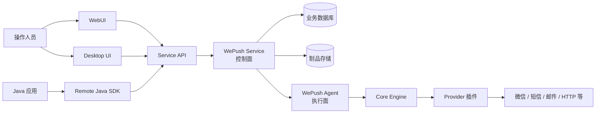
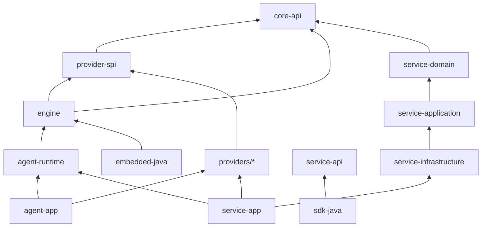
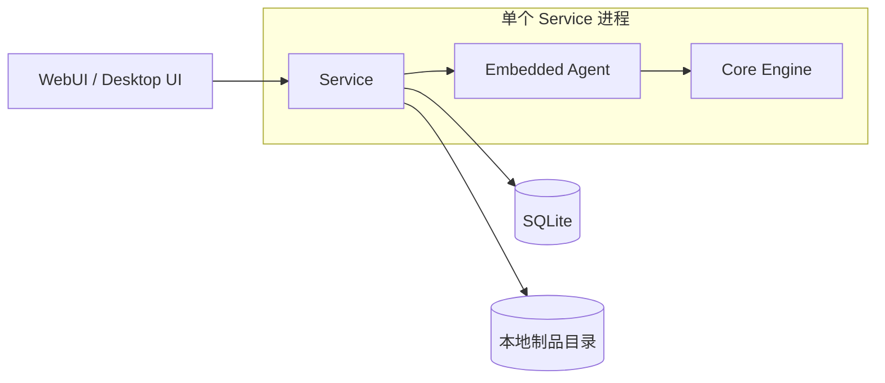
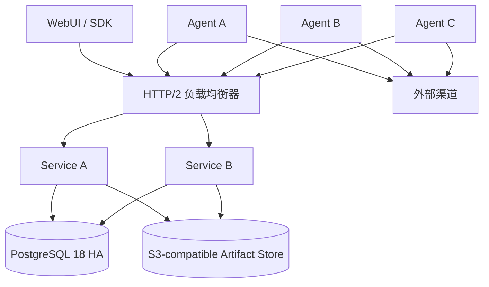
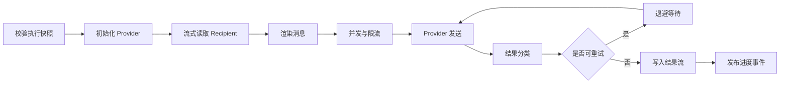
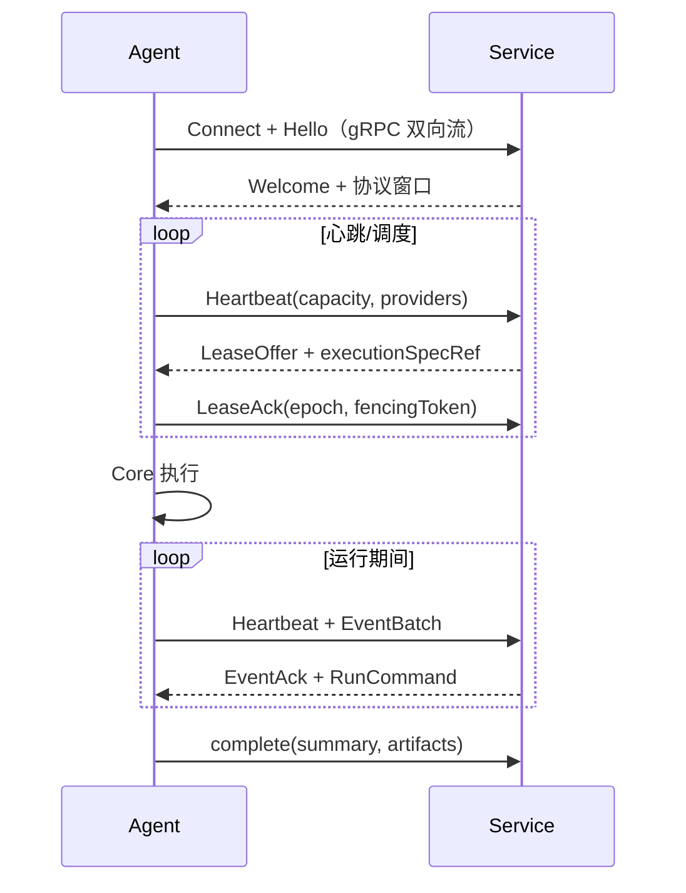
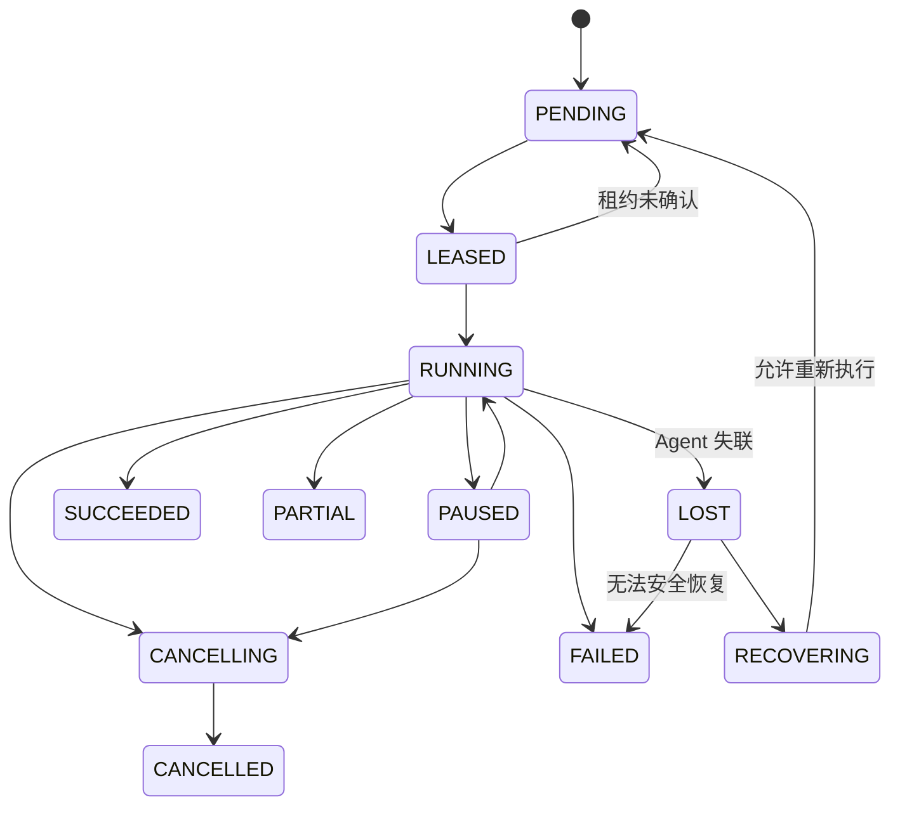

# WePush Next 架构与概要设计

- 文档状态：已接受基线
- 文档版本：0.3
- 日期：2026-08-27
- 适用范围：`next/`
- 关联决策：见 [ADR 索引](adr/README.md)
- 产品范围：[产品目标、边界与路线图](product-scope-and-roadmap.md)

## 1. 文档目的

本文档描述 WePush Next 的目标架构和概要设计，作为后续模块创建、接口设计、技术选型、任务拆分和验收的共同基线。

WePush Next 是独立于当前 Classic 客户端的新产品线。本文档不要求 Classic 按照本架构改造，也不限制 Classic 继续独立增加消息类型和功能。

## 2. 建设目标

WePush Next 的目标是从单机桌面推送工具发展为同时支持本地使用、用户自建服务化部署和分布式执行的消息推送产品。产品始终由用户自行下载、安装和运维，不建设官方公共 SaaS 或承载用户业务数据的集中平台。

主要目标如下：

- 提供与 UI、数据库和 Web 框架无关的 Core Engine。
- 提供可独立运行的 Agent，支持本地或远程执行推送任务。
- 提供可安装到 Linux、Windows 和 macOS 的 Service。
- Service 对外提供稳定、可版本化的 HTTP API。
- 提供轻量的远程 Java SDK 和依赖 Core 的嵌入式 Java SDK。
- 提供 WebUI 和 Desktop UI，两者使用相同的 Service API。
- 通过 Schema 驱动可视化配置，减少新增 Provider 时的 UI 开发量。
- 提供任务运行监控、实时日志、动态并发调整和交互式 API 文档。
- 支持从单机 SQLite 平滑发展到 PostgreSQL 和多 Agent 部署。
- 保证 Classic 与 Next 可以在同一台机器上并行安装和运行。

## 3. 非目标

以下项目不属于当前架构目标：

- 不追求与 Classic 的内部代码、数据模型或 UI 实现兼容。
- 不要求首个版本迁移 Classic 的全部消息类型。
- 不承诺外部消息渠道的严格 Exactly Once 语义。
- Standalone 首个版本不要求多节点；正式 Server 模式按 PostgreSQL 控制面高可用基线建设。
- 不在首期建设通用工作流编排平台。
- 不在 Core 中实现用户、权限、租户、HTTP API 或数据库管理。
- 不要求 WebUI 与 Desktop UI 使用完全相同的外壳技术，但应尽量共享前端能力。
- 不建设官方公共 SaaS、用户注册、计费、套餐、订阅、账单或公共市场。
- 不提供面向互不信任或恶意公共租户的物理隔离和跨区域 Active-Active 控制面。
- 不建设云 KMS、云 Secret Manager、Vault 或操作系统凭据库形式的 Service Secret Store 官方适配器。
- 不引入强制自动更新、远程配置下发或使用遥测回传。

长期产品边界及其变更规则以[《产品目标、边界与路线图》](product-scope-and-roadmap.md)为准。

## 4. 架构原则

### 4.1 明确执行位置

所有推送动作最终由 Agent 中的 Core Engine 执行。Service 负责任务定义、调度和控制，不直接包含消息渠道的发送业务逻辑。

单机模式可以将 Agent 嵌入 Service 进程，但逻辑边界保持不变。

### 4.2 依赖指向稳定抽象

Core Engine 依赖 Core API 和 Provider SPI，不依赖 Service、Agent、UI、MyBatis、Spring 或具体 Provider。

### 4.3 配置和运行快照分离

账号、消息、受众和任务定义可以被修改；一次 Run 启动后必须形成不可变执行快照，避免运行过程中读取到被修改的配置。

### 4.4 Schema 驱动扩展

Provider 使用 JSON Schema 描述账号、消息和受众配置，UI、API 校验和 SDK 辅助能力围绕同一份 Schema 工作。

### 4.5 事件驱动运行状态

Core 不直接更新 UI。进度、日志、告警和状态变化都以结构化 Run Event 输出，由 Agent 和 Service 负责传输与持久化。

### 4.6 默认安全

本地模式默认只监听回环地址；远程模式必须启用认证。Secret 不出现在日志、普通查询响应和运行事件中。

### 4.7 渐进式分布

先完成 Service 内嵌 Agent 的单机闭环，再引入远程 Agent。分布式能力建立在稳定的运行状态机和租约模型之上。

## 5. 系统上下文



## 6. 总体组件

| 组件 | 核心职责 | 明确不负责 |
|---|---|---|
| Core API | 执行命令、状态、事件、结果和策略的稳定模型 | 数据库、HTTP、UI、Provider 实现 |
| Core Engine | 执行流水线、并发、限流、重试、取消、结果汇总 | 调度、用户权限、REST API |
| Provider SPI | Provider 生命周期、配置 Schema、发送和能力接口 | 具体渠道实现 |
| Provider | 渠道协议适配、认证、请求构建和响应解释 | Service CRUD、UI 控件 |
| Agent | 注册、心跳、任务租约、Core 执行、事件上报 | 面向用户的业务管理 API |
| Service | 配置管理、调度、Run 编排、Agent 管理、持久化、认证 | 直接调用渠道发送消息 |
| Remote Java SDK | Service API 的类型安全客户端 | 本地执行引擎 |
| Embedded Java SDK | 在 Java 进程内使用 Core 和 Provider | 远程 Service 管理能力 |
| WebUI | 浏览器管理、配置、监控和 API 调试 | 直接访问数据库或 Core |
| Desktop UI | 桌面入口、本地 Service 管理、远程 Service 连接 | 直接执行 Provider |
| Distribution | 三平台安装、服务注册、升级和卸载 | 业务逻辑 |

## 7. 建议目录与模块结构

```text
next/
├── pom.xml
├── docs/
│   ├── architecture-and-high-level-design.md
│   └── adr/
├── platform/
│   └── wepush-bom/
├── core/
│   ├── core-api/
│   ├── provider-spi/
│   └── engine/
├── providers/
│   ├── provider-http/
│   ├── provider-mail/
│   └── ...
├── agent/
│   ├── agent-protocol/
│   ├── agent-runtime/
│   └── agent-app/
├── service/
│   ├── service-api/
│   ├── service-domain/
│   ├── service-application/
│   ├── service-infrastructure/
│   └── service-app/
├── sdk/
│   ├── sdk-java/
│   └── embedded-java/
├── ui/
│   ├── web/
│   └── desktop/
├── distributions/
│   ├── linux/
│   ├── windows/
│   └── macos/
└── tests/
    ├── architecture-tests/
    ├── contract-tests/
    ├── integration-tests/
    └── end-to-end-tests/
```

模块可以随实现进展合并或拆细，但组件依赖方向不得被破坏。

## 8. 模块依赖规则



强制规则：

- `core/*` 不得依赖 `agent/*`、`service/*`、`sdk/*` 或 `ui/*`。
- Provider 不得直接访问 Service 数据库。
- `sdk-java` 不得依赖 Engine 或具体 Provider。
- `embedded-java` 可以依赖 Engine 和选定 Provider。
- UI 只能通过公开 API 或 SDK 访问 Service。
- Service 的领域层不得依赖 Controller、数据库实现或操作系统服务实现。
- 可使用架构测试阻止禁止的包依赖进入主分支。

## 9. 部署形态

### 9.1 Standalone 单机模式



适用个人电脑、开发环境和轻量服务器。Service、调度器和内嵌 Agent 在同一进程内运行，使用 SQLite 和本地文件系统。

### 9.2 Server + Remote Agent 模式



远程 Agent 主动通过负载均衡器建立出站 gRPC 双向流，便于跨防火墙部署。正式 Server HA 至少包含两个无状态 Service 实例；PostgreSQL 是业务和协调状态的事实源，对象制品不得依赖某个 Service 的本地磁盘。具体约束见 [ADR-0006](adr/0006-postgresql-control-plane-ha.md)。

### 9.3 Embedded 模式

业务 Java 应用通过 `embedded-java` 直接创建 Engine，并显式注册所需 Provider。该模式不依赖 Service，但也不自动获得 Service 的用户管理、调度、持久化和 WebUI 能力。

## 10. Core Engine 概要设计

### 10.1 核心输入

Engine 接收不可变的 `RunExecutionSpec`，主要包含：

- `runId`
- Provider 标识和版本
- 账号配置或 Secret 引用
- 消息模板快照
- 受众快照或可流式读取的 Recipient Source
- 并发、限流和重试策略
- Dry Run、结果保存和超时策略
- 执行环境及扩展属性

Engine 不接受数据库主键后自行查询数据库，所有执行所需信息由调用方准备并显式传入。

### 10.2 执行流水线



### 10.3 执行策略

- `ConcurrencyPolicy`：固定并发或可动态调整并发。
- `RateLimitPolicy`：全局、Provider、账号或任务级速率限制。
- `RetryPolicy`：最大次数、指数退避、抖动和可重试错误分类。
- `TimeoutPolicy`：单次请求和整个 Run 的超时。
- `ResultPolicy`：结果明细、响应体、失败样本和制品保存策略。
- `CancellationPolicy`：协作式取消和取消后的未发送数据处理。

Java 21 虚拟线程可以作为 I/O 型发送的默认执行单元，但必须通过并发闸门和限流器限制实际外部请求数量，不能把虚拟线程数量直接等同于渠道并发能力。

### 10.4 事件接口

Core 通过 `RunEventSink` 输出结构化事件，例如：

- `RUN_STARTED`
- `PROGRESS_UPDATED`
- `ITEM_FAILED`
- `CONCURRENCY_CHANGED`
- `RETRY_SCHEDULED`
- `RUN_CANCELLING`
- `RUN_COMPLETED`
- `RUN_FAILED`

高频进度在 Agent 内聚合后批量上报，避免每条消息产生一次数据库写入。

### 10.5 结果与内存模型

- Recipient、发送结果和日志均采用流式或批量处理。
- 不在内存中长期保存完整的成功、失败和未发送列表。
- 大结果集写入 Artifact Store，数据库只保存摘要、索引和制品引用。
- Run 结束时生成成功、失败、未发送和可选响应体制品。

## 11. Provider SPI 概要设计

### 11.1 Provider 能力

每个 Provider 至少暴露：

- 唯一 `providerId` 和实现版本。
- 展示名称、分类和能力列表。
- 账号配置 JSON Schema。
- 消息配置 JSON Schema。
- 受众字段定义及可选受众配置 Schema。
- 配置校验和连接测试能力。
- 同步发送接口；异步渠道可通过统一结果句柄扩展。
- 错误分类、是否可重试和建议退避时间。
- 可选 Dry Run、预览和动态限流能力。

### 11.2 Schema 示例

```json
{
  "providerId": "wepush.http",
  "version": "1.0.0",
  "capabilities": ["preview", "dry-run", "response-body"],
  "accountSchema": {"$ref": "schemas/account.json"},
  "messageSchema": {"$ref": "schemas/message.json"},
  "uiSchema": {"$ref": "schemas/ui.json"}
}
```

敏感字段通过 `writeOnly` 及 `x-wepush-secret` 标识。UI 只显示“已配置”状态，Service 查询接口不得返回原值。

### 11.3 Provider 生命周期

Provider 实例应按账号和执行上下文创建，禁止使用可变全局单例保存 Token、连接和运行进度。连接池可以共享，但必须具有明确的关闭和隔离策略。

外部 Provider 使用 PF4J 3.15.x 发现，每个插件使用独立 ClassLoader 隔离私有厂商 SDK。正式环境仅装载清单与 Ed25519 签名均通过验证的版本。更新采用版本化目录、Agent Drain、重启、验证和激活流程，多 Agent 场景滚动执行；不在 JVM 内热替换正在使用的 Provider。ClassLoader 隔离不是恶意代码沙箱；如果用户自建安全场景需要运行非受信插件，必须单独评审独立进程 Runner，当前不将其列为既定路线图。详见 [ADR-0005](adr/0005-provider-plugin-lifecycle.md)。

## 12. Agent 概要设计

### 12.1 职责

- 向 Service 注册 Agent 身份、版本和能力。
- 周期性上报心跳、负载、Provider 清单和运行状态。
- 领取有时限的 Run Lease。
- 下载执行快照和所需制品。
- 调用 Core Engine 执行。
- 批量上报事件、指标和结果制品。
- 接收取消、暂停、恢复和动态调整并发等命令。
- 在进程退出时尽力完成优雅停止。

### 12.2 租约与恢复



- Lease 有明确到期时间并通过心跳续约。
- Agent 失联后，Run 先进入 `LOST` 或 `RECOVERING`，不能立即无条件重发。
- 如果外部渠道已接收请求、但结果尚未持久化，系统可能无法确定发送结果，应标记为 `UNKNOWN`。
- 支持渠道幂等键时应传递 `runId + itemId`；不支持时明确接受极端故障下的重复风险。

### 12.3 Agent 与 Service 协议

远程 Agent 的长期控制协议固定为 HTTP/2 上的 gRPC 双向流，契约使用 Protobuf。连接承载 Hello、心跳、能力、Lease、命令、事件确认和终态；每个方向具有单调 Sequence，Lease 仍使用 Epoch 和 Fencing Token。

Enrollment 和凭据轮换使用 HTTPS REST；WebUI、Desktop UI 和远程 SDK 的 Run 实时事件使用 SSE；大体积 Artifact 通过短期签名 HTTPS URL 传输。正式远程 Agent 不发布长轮询过渡协议，也不默认使用 WebSocket。详见 [ADR-0004](adr/0004-agent-communication-protocol.md)。

## 13. Service 概要设计

### 13.1 分层

- `service-api`：公开 DTO、API 契约和错误模型。
- `service-domain`：领域实体、状态机和仓储接口。
- `service-application`：用例编排、事务边界和权限检查。
- `service-infrastructure`：数据库、Secret、Artifact、Agent 通信等适配器。
- `service-app`：Web 框架、配置、启动和部署入口。

Service 基线固定为 Java 21 和 Spring Boot 4.1.x，初始实现版本为 4.1.1；数据库迁移使用显式版本化迁移工具，依赖版本由 BOM 统一管理。Spring 只存在于 Service App、Web 和 Infrastructure 层，不进入 Core、Provider SPI、Agent Runtime、Remote Java SDK 或 Embedded SDK。详见 [ADR-0002](adr/0002-technology-baseline.md)。

### 13.2 主要领域对象

| 对象 | 说明 |
|---|---|
| ProviderDescriptor | 已安装 Provider、版本、能力和 Schema |
| Account | 渠道账号元数据及 Secret 引用 |
| MessageTemplate | 消息模板及版本 |
| Audience | 受众定义 |
| AudienceSnapshot | 一次物化后的不可变受众版本 |
| JobDefinition | 账号、消息、受众和执行策略的组合 |
| Schedule | Cron、时区、启停和错过执行策略 |
| Run | 一次执行实例和状态摘要 |
| RunSnapshot | Run 启动时冻结的完整执行配置 |
| Agent | 执行节点身份、能力和状态 |
| AgentLease | Agent 对 Run 的限时所有权 |
| RunEvent | 状态、进度、日志和控制事件 |
| Artifact | 输入快照、结果、日志等大对象引用 |

### 13.3 Run 状态机



所有状态变更由应用服务执行并校验前置状态，Controller、UI 和 Agent 不能直接修改数据库状态字段。

### 13.4 调度

- Schedule 归 Service 管理，不属于 UI。
- 每次调度触发创建独立 Run 和 Run Snapshot。
- 明确时区和夏令时行为。
- 支持错过触发策略：跳过、立即补一次或按限制补偿。
- Standalone 由单 Service 调度；Server HA 由持有 PostgreSQL Session Advisory Lock 的实例运行 Schedule Scanner，连接失效即释放领导权。

## 14. 对外 API 设计

### 14.1 基本约定

- API 前缀：`/api/v1`；Workspace 业务资源前缀为 `/api/v1/workspaces/{workspaceId}`。
- OpenAPI 作为公开契约和 SDK 生成来源。
- 资源标识使用不透明 ID，建议 UUID 或 UUIDv7。
- 创建 Run 等非幂等操作支持 `Idempotency-Key`。
- 列表接口统一分页、排序和过滤。
- 错误响应使用统一 Problem Detail 模型，并包含稳定错误码和 Trace ID。
- Secret 字段只写不读，更新时支持“保持原值”和“替换”。

### 14.2 主要资源

```text
GET    /api/v1/providers
GET    /api/v1/providers/{providerId}/schemas

POST   /api/v1/workspaces/{workspaceId}/accounts
GET    /api/v1/workspaces/{workspaceId}/accounts
PATCH  /api/v1/workspaces/{workspaceId}/accounts/{id}
POST   /api/v1/workspaces/{workspaceId}/accounts/{id}/connection-test

POST   /api/v1/workspaces/{workspaceId}/messages
PATCH  /api/v1/workspaces/{workspaceId}/messages/{id}
GET    /api/v1/workspaces/{workspaceId}/messages/{id}/revisions
POST   /api/v1/workspaces/{workspaceId}/audiences
PATCH  /api/v1/workspaces/{workspaceId}/audiences/{id}
POST   /api/v1/workspaces/{workspaceId}/audience-imports
POST   /api/v1/workspaces/{workspaceId}/audience-imports/{id}/commit

POST   /api/v1/workspaces/{workspaceId}/jobs
PATCH  /api/v1/workspaces/{workspaceId}/jobs/{id}
POST   /api/v1/workspaces/{workspaceId}/jobs/{id}/run-confirmation
POST   /api/v1/workspaces/{workspaceId}/jobs/{id}/runs
POST   /api/v1/workspaces/{workspaceId}/schedules

GET    /api/v1/workspaces/{workspaceId}/overview
GET    /api/v1/workspaces/{workspaceId}/runs/{id}
POST   /api/v1/workspaces/{workspaceId}/runs/{id}/retry-confirmation
POST   /api/v1/workspaces/{workspaceId}/runs/{id}/retries
POST   /api/v1/workspaces/{workspaceId}/runs/{id}/commands/cancel
POST   /api/v1/workspaces/{workspaceId}/runs/{id}/commands/pause
POST   /api/v1/workspaces/{workspaceId}/runs/{id}/commands/resume
POST   /api/v1/workspaces/{workspaceId}/runs/{id}/commands/concurrency
GET    /api/v1/workspaces/{workspaceId}/runs/{id}/events
GET    /api/v1/workspaces/{workspaceId}/runs/{id}/artifacts
```

### 14.3 实时事件

运行监控首期采用 Server-Sent Events。客户端可以携带事件游标或 `Last-Event-ID` 断线续传；历史事件仍可通过普通分页 API 查询。

命令通过 REST 提交，事件通过 SSE 下发。浏览器端不默认引入 WebSocket。

### 14.4 交互式 API 文档

Service 提供：

- `/openapi.json` 或等价 OpenAPI 描述地址。
- `/docs` 交互式文档页面。
- 当前登录身份的认证信息注入。
- 请求示例、响应示例和错误码说明。
- Try It Out 动态调用能力。

生产环境中，API 调试页面必须经过权限控制。危险操作需要二次确认，Secret 不得写入浏览器持久化存储或出现在生成的示例中。

## 15. Remote Java SDK 设计

### 15.1 远程 SDK

`sdk-java` 面向 Service API：

- 从 OpenAPI 生成底层模型和客户端。
- 在生成代码之上提供稳定的手写 Facade。
- 支持认证、超时、重试、分页和 SSE 订阅。
- 不依赖 Core Engine、Provider 或 Service 内部实体。
- SDK 的兼容性以公开 API 为准，而不是以 Service 内部版本为准。

### 15.2 Embedded SDK

`embedded-java` 面向本地进程内执行：

- 依赖 Core Engine 和用户选择的 Provider。
- 使用显式 Builder 注册 Provider、Secret Resolver、事件和结果适配器。
- 不自动启动 Service，不包含 WebUI 和 Service 数据库。
- 可以为测试、第三方 Java 应用嵌入和自定义执行环境提供能力。

## 16. WebUI 概要设计

主要功能区域：

- 总览：Service、Agent、Provider 和近期 Run 状态。
- 账号管理：Schema 动态表单、连接测试和 Secret 状态。
- 消息管理：可视化配置、模板变量、预览和 Dry Run。
- 受众管理：文件、数据库、第三方来源导入及快照管理。
- 任务与调度：任务组合、执行策略、Cron 和时区。
- 运行中心：进度、吞吐、成功率、失败分类、并发动态调整。
- 日志与制品：实时日志、结果下载、失败重试入口。
- Agent 管理：在线状态、版本、能力、负载和禁用。
- API 文档：动态接口说明和在线调试。

动态表单由 Provider Schema 驱动。JSON Schema 负责数据类型和校验，UI Schema 负责分组、顺序、控件提示和 WePush 扩展控件。

前端固定采用 TypeScript 6.0.x、Vite 8.1.x 和 React 19.2.x，以 Node.js 24 LTS、pnpm 和单一 Lockfile 管理工程。样式采用 Tailwind CSS；shadcn/ui 只在能降低复杂组件成本时按需引入，复制进仓库的组件源码由项目自行维护。WebUI 是纯 SPA，正式运行不依赖 Node.js 服务端。详见 [ADR-0002](adr/0002-technology-baseline.md)。

## 17. Desktop UI 概要设计

Desktop UI 是 Service API 的薄客户端，不直接依赖 Core 或数据库。

目标能力：

- 连接本机 Standalone Service 或远程 Service。
- 首次运行引导和本地 Service 状态管理。
- 提供系统托盘、通知、自动启动和桌面更新体验。
- 尽量复用 WebUI 页面、Schema 渲染器和 API 客户端。
- 本地连接使用回环地址和短期引导凭据，避免无认证端口。

Desktop 外壳固定为 Electron 43.x，并复用 WebUI 的 React 页面、Schema Renderer、API Client 和设计 Token。Main、Preload、Renderer 严格分层；Renderer 禁用 Node.js 集成，启用 Context Isolation 和 Sandbox，只通过最小白名单 IPC 使用桌面能力。该选择不改变 Desktop 只能通过 Service API 访问业务能力的边界。详见 [ADR-0002](adr/0002-technology-baseline.md)。

## 18. 数据与存储设计

### 18.1 数据库

- Standalone 默认 SQLite。
- Server 模式固定使用 PostgreSQL 18.x；数据库自身复制、故障转移和备份由部署者选择并负责运维。
- 通过 Repository Port 隔离数据库实现，但不以支持任意数据库为目标。
- 所有 Schema 变化必须使用版本化迁移，不允许运行时拼接临时升级逻辑。
- 数据库事务以应用用例为边界，不共享全局 Session。

### 18.2 Artifact Store

Artifact Store 保存：

- Audience Snapshot 数据文件。
- 成功、失败、未发送结果。
- 可选 Provider 响应体。
- 大体积日志和导出文件。

Standalone 默认使用 `LocalFileArtifactStore`；Server 默认使用受控 S3-compatible API 的 `S3ArtifactStore`。Agent 使用 Service 签发的短期 Presigned URL 直传，数据库保存元数据、SHA-256、大小、状态和对象键。对象键按 Workspace 分区；保留期由 Service 清理任务执行，对象存储 Lifecycle 只作兜底。详见 [ADR-0007](adr/0007-artifact-store-and-retention.md)。

### 18.3 Secret Store

- 默认实现为 `LocalEnvelopeSecretStore`，每个 Secret 使用独立随机 DEK 和 AES-256-GCM 加密，AAD 绑定 Workspace、Secret ID、类型和版本。
- 数据库保存密文、Nonce、加密后的 DEK 和主密钥版本；主密钥只来自独立受保护文件或显式外部注入。
- Standalone 首启可创建仅当前用户可读的主密钥文件；Server 不得静默生成新主密钥，缺失或权限不安全时 Fail Closed。
- `SecretStore` 保持 Port 以维持模块边界和可测试性；官方产品实现固定为本地信封加密，不规划 Vault、云 KMS、云 Secret Manager 或操作系统凭据存储适配器。Electron `safeStorage` 不作为 Service Secret 实现。
- Agent 只在执行期间获取最小范围 Secret，并在内存中短期持有。

密钥轮换默认只重包裹 DEK，不重写业务密文。详见 [ADR-0003](adr/0003-default-secret-store.md)。

## 19. 安全设计

- Standalone 默认绑定 `127.0.0.1` 或 `::1`。
- 远程访问必须使用 TLS。
- 用户 API 支持管理员、操作员和只读角色。
- Agent 使用独立身份，不复用用户 Token。
- 关键操作记录审计事件，包括操作者、时间、对象和结果。
- 所有日志、事件、异常和 API 响应经过 Secret Redactor。
- 文件上传限制大小、类型和解析资源，防止压缩炸弹和超大内存占用。
- HTTP Provider 对目标地址提供可配置的 SSRF 防护策略。
- API 调试功能遵循当前用户权限，不提供绕过权限的内部调用通道。

Workspace 逻辑隔离进入正式 Server 产品范围；Standalone 自动使用隐藏的 Default Workspace。Account、Secret、Message、Audience、Job、Schedule、Run、Artifact、Agent Pool 和 API Token 均必须归属 Workspace，所有 Repository、唯一索引、缓存键和授权检查显式携带 `workspaceId`。Workspace 只服务于同一用户自建实例内的团队和权限分组，不演进为公共 SaaS 租户；计费、自助注册和恶意租户物理隔离属于长期非目标。详见 [ADR-0008](adr/0008-workspace-multitenancy-scope.md)。

## 20. 可观测性

Service 和 Agent 应提供：

- Health、Readiness 和版本信息。
- 结构化日志和统一 Trace ID、Run ID、Agent ID。
- Run 级吞吐、成功、失败、重试、限流和延迟指标。
- Agent 心跳延迟、可用容量和任务数。
- Provider 请求耗时和错误分类，但不记录敏感请求内容。
- 审计日志与普通运行日志分离。

监控接口默认不公开到非受信网络。

## 21. 交付与跨平台安装

### 21.1 Service 制品

- 通用可执行 JAR 或应用镜像。
- Linux：tar/deb/rpm，并提供 systemd 服务单元。
- Windows：zip/msi/exe，并通过 Windows Service Wrapper 或等价机制注册服务。
- macOS：pkg/dmg，并通过 launchd 注册服务或用户级 Agent。
- 可选 Docker/OCI 镜像作为 Linux Server 部署补充。

### 21.2 独立标识

Next 必须使用独立于 Classic 的：

- 应用名称和 Service 名称，例如 `WePush Next`、`wepush-next`。
- 默认配置目录和数据目录。
- 默认端口。
- 日志目录。
- 用户可控的版本检查标识和发布资产名称；不使用与 Classic 混合的更新元数据。

安装、升级和卸载不得读取、覆盖或删除 Classic 的文件。

## 22. 一致性与投递语义

WePush Next 对外声明 At Least Once 为基础投递语义。

当外部渠道已经接受请求，但 Agent 在持久化结果前崩溃时，系统无法可靠判断是否已发送。此类消息应进入 `UNKNOWN`，由用户或策略决定是否重试。只有 Provider 原生支持幂等键时，才可以提供更强的去重保证。

Run 的状态摘要、事件和结果制品允许短暂最终一致，但终态必须经过校验，确保计数与已持久化结果可追溯。

## 23. 测试策略

| 测试类型 | 重点 |
|---|---|
| 单元测试 | 状态机、模板、重试、限流、结果分类 |
| 架构测试 | 禁止依赖、包边界、Core 纯净性 |
| Provider 契约测试 | Schema、配置校验、错误分类、Dry Run |
| API 契约测试 | OpenAPI、错误模型、兼容性和 SDK 生成 |
| 集成测试 | SQLite、PostgreSQL 18、S3-compatible Artifact、Secret、SSE、Agent gRPC |
| 故障测试 | Agent 失联、Service 重启、租约到期、重复上报 |
| 性能测试 | 大受众流式处理、并发、内存上限和事件聚合 |
| E2E 测试 | WebUI/SDK 创建任务到结果下载完整链路 |
| 安装测试 | Linux、Windows、macOS 安装、启动、升级和卸载 |

发布流水线必须先完成测试和契约校验，再生成平台安装包。安装包构建不得通过跳过测试来代替独立的测试阶段。

## 24. Classic 数据迁移

迁移是可选辅助能力，不是两个产品线的运行时连接。

- 迁移工具只读 Classic 数据库和配置。
- 迁移前创建可恢复备份。
- 将 Classic 账号、消息、受众和任务转换为 Next 模型。
- Secret 在导入过程中重新加密。
- 不保证所有 Classic 配置都能无损转换，无法转换的内容生成报告。
- 不提供持续双向同步。
- Next 运行时不得直接访问 Classic 数据库。

## 25. 版本与兼容策略

- Next 在架构建设期使用独立的 `0.x` 版本。
- 公开 API 使用路径主版本，例如 `/api/v1`。
- Remote Java SDK 与 API 兼容矩阵独立于 Service 内部模块版本。
- Agent 协议单独版本化，Service 应允许一个受控范围内的新旧 Agent 共存。
- Provider SPI 的不兼容变化必须提升 SPI 主版本。
- Run Snapshot 保存必要的 Provider 和 Schema 版本，便于结果追溯。

## 26. 首个纵向里程碑

第一阶段不追求创建所有 Provider 和所有 UI 页面，而是完成 HTTP Provider 的完整闭环：

1. HTTP Provider 提供账号和消息 Schema。
2. Core Engine 能流式执行、限流、取消并输出事件。
3. Embedded Agent 能领取并执行 Run。
4. Service 能管理账号、消息、受众、任务和 Run。
5. Remote Java SDK 能创建任务、启动 Run 和订阅事件。
6. WebUI 能动态配置 HTTP Provider、启动 Run 并查看实时结果。
7. Standalone 安装包能在至少一个平台完成安装和重启恢复。

该纵向链路通过后，再依次增加 Mail、短信、微信等 Provider，以及远程 Agent 和三平台完整安装。

## 27. 阶段规划

### 阶段 A：工程和契约基线

- 创建 Maven 聚合工程和模块边界。
- 定义 Core API、Provider SPI 和架构测试。
- 定义 OpenAPI、错误模型和 Provider Schema 约定。

### 阶段 B：单机运行闭环

- 实现 Core Engine、HTTP Provider 和 Embedded Agent。
- 实现 Service、SQLite、Artifact 和基础 Secret 存储。
- 完成 Remote Java SDK 和最小 WebUI。

### 阶段 C：产品化单机版本

- 完善可视化配置、任务调度、运行监控和 API 文档。
- 增加 Desktop UI 和三平台 Service 安装。
- 完成升级、备份和故障恢复。

### 阶段 D：服务器与分布式执行

- 增加 PostgreSQL、远程 Agent 和租约恢复。
- 增加 Agent 管理、RBAC、审计和远程 TLS。
- 落实 S3-compatible Artifact Store 和 PostgreSQL 控制面高可用。

### 阶段 E：Provider 扩展

- 按业务优先级迁移或重新实现消息类型。
- 为每个 Provider 建立契约测试和模拟服务。
- 完善 Schema 组件库和 Provider 开发文档。

截至 2026-08-23，阶段 A–D 的 `0.1.0` 架构基线已经实现并进入持续验证；阶段 E 是按业务优先级持续增加消息类型的长期产品迭代，不阻塞当前 Next 目标架构成立。实现证据见 [实现状态](implementation-status.md)，安装、HA、升级和恢复见 [部署与运维](deployment-and-operations.md)。

## 28. 已接受的架构决策

- [ADR-0001：Classic 与 Next 双轨独立发展](adr/0001-dual-track-development.md)
- [ADR-0002：Service、WebUI 与 Desktop 技术基线](adr/0002-technology-baseline.md)
- [ADR-0003：默认 Secret Store](adr/0003-default-secret-store.md)
- [ADR-0004：Agent 长期通信协议](adr/0004-agent-communication-protocol.md)
- [ADR-0005：Provider 插件发现、隔离和更新](adr/0005-provider-plugin-lifecycle.md)
- [ADR-0006：PostgreSQL Server 模式控制面高可用](adr/0006-postgresql-control-plane-ha.md)
- [ADR-0007：Artifact Store 协议和保留策略](adr/0007-artifact-store-and-retention.md)
- [ADR-0008：Workspace 多租户范围](adr/0008-workspace-multitenancy-scope.md)

这些决策是 Next 初始实现的正式基线。公共 SaaS、计费订阅、外部 Vault/云 KMS/Secret Manager、恶意租户物理隔离和跨地域控制面属于长期非目标，不得通过临时代码或普通功能 ADR 隐式引入。非受信 Provider 的进程级隔离只有在明确服务于用户自建安全场景时才可以单独评审，且不得改变产品定位。

## 29. 架构验收条件

以下条件用于判断首个架构闭环是否成立：

- Core 模块不存在 Swing、AWT、Spring、MyBatis 和具体数据库依赖。
- Core 可以在纯单元测试中使用内存适配器执行完整 Run。
- Provider 不通过数据库 ID 自行加载账号或消息配置。
- 同一个 HTTP Run 可以由 Embedded Agent 和 Remote Agent 使用相同 Core 行为执行。
- WebUI、Desktop UI 和 Remote Java SDK 通过同一公开 API 管理任务。
- Service 重启后能够恢复非终态 Run，并明确区分可重试和结果未知状态。
- Agent 失联不会导致 Service 无限等待，也不会未经判断立即重复发送。
- 大受众执行不要求将全部 Recipient 和结果加载到内存。
- Secret 不出现在查询响应、日志、事件和结果制品中。
- OpenAPI 能生成 Remote Java SDK，并通过 API 契约测试。
- Classic 与 Next 能在同一台机器上同时安装和运行，配置和数据互不影响。

## 30. 文档维护

本文档描述当前目标架构，不替代详细设计、API 契约和 ADR。

- 会改变跨组件边界的决策必须新增或更新 ADR。
- 单个模块内部的详细设计应放在对应模块的 `docs/` 或 README 中。
- OpenAPI、JSON Schema 和数据库迁移文件是可执行契约，应与实现一同评审。
- 当实现与本文档不一致时，应先确认是实现偏离还是架构演进，再更新代码或文档，不能长期保持隐式差异。
