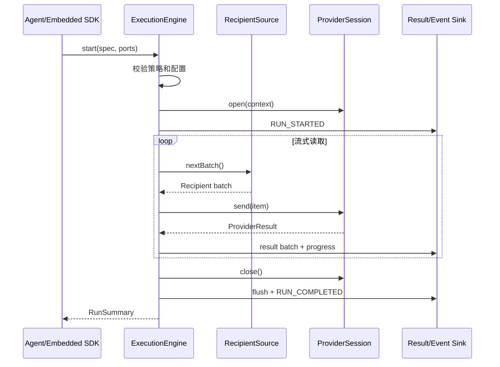
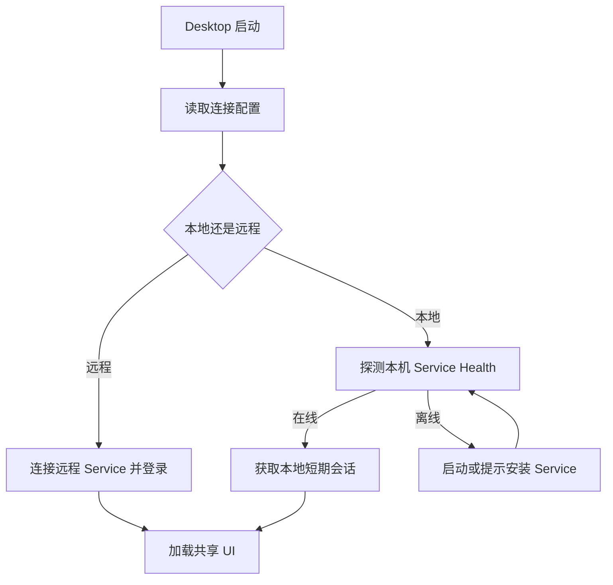

# WePush Next 详细设计

- 文档状态：已接受基线，随实现演进
- 文档版本：0.2
- 日期：2026-08-22
- 适用范围：`next/`
- 上位文档：[WePush Next 架构与概要设计](architecture-and-high-level-design.md)
- 关联决策：见 [ADR 索引](adr/README.md)

## 1. 文档目的

本文档在架构与概要设计基础上，进一步定义 WePush Next 各组件的模块、接口、状态、数据、协议、异常、并发和部署细节，使开发人员可以据此拆分任务并开始实现。

文中的 Java 接口和 JSON 结构用于表达设计契约，正式实现时可以调整语法和类型名称，但不得未经评审改变组件职责、依赖方向和对外协议语义。

## 2. 已确定的设计基线

| 项目 | 首期设计基线 |
|---|---|
| Java | Java 21 |
| 构建 | `next/pom.xml` 独立 Maven 聚合工程 |
| Service | Java 21、Spring Boot 4.1.x，初始版本 4.1.1 |
| API | HTTPS REST；Workspace 资源前缀 `/api/v1/workspaces/{workspaceId}` |
| 实时事件 | Server-Sent Events |
| API 契约 | Contract First OpenAPI 3.1 |
| Provider 配置 | JSON Schema 2020-12 + UI Schema |
| WebUI | TypeScript 6.0.x、Vite 8.1.x、React 19.2.x、Tailwind CSS、按需 shadcn/ui |
| Desktop | Electron 43.x，复用 WebUI Renderer |
| Agent 协议 | HTTP/2 + Protobuf + gRPC 双向流；Enrollment 使用 HTTPS REST |
| Provider 插件 | PF4J 3.15.x、签名包、ClassLoader 隔离、滚动重启更新 |
| Standalone 数据库 | SQLite |
| Server 数据库 | PostgreSQL 18.x；至少两个无状态 Service 实例构成正式 HA |
| Secret | `LocalEnvelopeSecretStore`，AES-256-GCM 信封加密 |
| 大对象 | Standalone 本地文件；Server 使用 S3-compatible Artifact Store |
| 租户边界 | Workspace 逻辑多租户进入正式 Server 范围 |
| 投递语义 | At Least Once；支持时使用 Provider 幂等键 |
| 单机执行 | Service 内嵌 Agent |
| 分布式执行 | 远程 Agent 主动连接 Service |

上述基线分别由 [ADR-0002](adr/0002-technology-baseline.md) 至 [ADR-0008](adr/0008-workspace-multitenancy-scope.md) 固化。外部 Secret Manager、公共 SaaS 和非受信插件进程沙箱是可选扩展，不影响首期基线。

## 3. 命名与代码约定

### 3.1 Maven 坐标

建议使用以下坐标：

```text
groupId:    com.fangxuele.wepush.next
artifactId: wepush-next-<module>
```

Next 不复用 Classic 的包名，防止类路径混淆和误依赖。

### 3.2 Java 包名

```text
com.fangxuele.wepush.next.core.api
com.fangxuele.wepush.next.core.engine
com.fangxuele.wepush.next.provider.spi
com.fangxuele.wepush.next.provider.http
com.fangxuele.wepush.next.agent.protocol
com.fangxuele.wepush.next.agent.runtime
com.fangxuele.wepush.next.service.api
com.fangxuele.wepush.next.service.domain
com.fangxuele.wepush.next.service.application
com.fangxuele.wepush.next.service.infrastructure
com.fangxuele.wepush.next.sdk
com.fangxuele.wepush.next.embedded
```

### 3.3 领域术语

| 术语 | 含义 |
|---|---|
| Provider | 一个具体消息渠道能力实现 |
| Account | Provider 账号配置及 Secret 引用 |
| Message | 可版本化的消息模板 |
| Audience | 受众定义 |
| Audience Snapshot | 不可变、可执行的受众快照 |
| Job | Account、Message、Audience 和执行策略的组合 |
| Schedule | Job 的定时触发规则 |
| Run | Job 的一次执行实例 |
| Run Snapshot | Run 启动时冻结的全部执行配置 |
| Recipient | 一条目标数据及模板变量 |
| Item | Run 中一条 Recipient 的执行单元 |
| Artifact | 输入、日志、结果等大体积制品 |
| Lease | Agent 在限定时间内对 Run 的执行权 |

## 4. 代码模块和职责

### 4.1 Core 模块

```text
core/core-api
    ID、值对象、RunExecutionSpec、RunEvent、RunSummary、执行策略

core/provider-spi
    ProviderFactory、ProviderSession、配置 Schema、错误分类

core/engine
    DefaultExecutionEngine、调度循环、并发、限流、重试、事件聚合
```

### 4.2 Agent 模块

```text
agent/agent-protocol
    Agent 与 Service 的版本化 DTO，不直接复用 Service 数据库实体

agent/agent-runtime
    Agent 状态机、Lease 管理、Core 调用、事件缓冲、命令执行

agent/agent-app
    远程 Agent 启动入口、Provider 组合、配置和操作系统集成
```

### 4.3 Service 模块

```text
service/service-api
    OpenAPI 文件、生成的 Server 接口、公开 DTO、错误码

service/service-domain
    领域对象、状态机、Repository Port、领域规则

service/service-application
    用例、权限、事务编排、DTO 映射

service/service-infrastructure
    JDBC、Artifact、Secret、Agent 协议、系统时间等适配器

service/service-app
    Spring Boot、Controller、Security、配置和内嵌 Agent 组合
```

### 4.4 组合原则

- `agent-runtime` 只依赖 Provider SPI，不编译依赖某个具体 Provider。
- `agent-app` 和 `service-app` 是具体 Provider 的组合入口。
- `embedded-java` 只提供 Engine 装配能力，业务应用自行添加 Provider 依赖。
- Service 的公开 DTO、Agent 协议 DTO、Core 对象和数据库记录是四类不同模型，通过 Mapper 显式转换。
- 禁止为了减少转换而让数据库记录穿透到 Controller、Agent 或 Core。

## 5. 标识、时间和版本

### 5.1 标识

- 对外资源 ID 使用不透明字符串，首期建议 UUIDv7。
- 数据库主键与 API ID 使用同一逻辑 ID，避免暴露自增序号。
- Recipient Item ID 由 `runId + audienceSnapshotId + sequence` 稳定生成。
- Agent、Lease、Event 和 Artifact 都使用独立 ID。

### 5.2 时间

- Java 内部使用 `Instant` 表示绝对时间。
- API 使用 UTC ISO-8601，例如 `2026-08-22T08:30:00Z`。
- Schedule 单独保存 IANA 时区，例如 `Asia/Shanghai`。
- 数据库统一保存 UTC；仅在 API 和 UI 边界转换时区。
- 所有超时使用 `Duration`，禁止使用无单位的裸整数。

### 5.3 版本

- Provider 具有实现版本和 SPI 主版本。
- Schema 具有独立 `schemaVersion`。
- Agent 协议通过 URL 和消息字段双重版本化。
- Run Snapshot 保存 Provider、Schema、模板和 Audience Snapshot 版本。

## 6. Core API 数据模型

### 6.1 配置文档

Core 不依赖 Jackson `JsonNode`。跨 Core 边界的 Provider 配置使用不可变文档：

```java
public record ConfigDocument(
        String schemaId,
        String schemaVersion,
        String mediaType,
        byte[] canonicalContent
) {
    public ConfigDocument {
        canonicalContent = canonicalContent.clone();
    }

    @Override
    public byte[] canonicalContent() {
        return canonicalContent.clone();
    }
}
```

默认 `mediaType` 为 `application/json`。Provider 在自己的模块中解析为强类型配置。

### 6.2 Secret 引用

```java
public record SecretRef(String namespace, String name, String version) {}

public interface SecretResolver {
    SecretValue resolve(SecretRef ref);
}

public interface SecretValue extends AutoCloseable {
    char[] copyChars();
    byte[] copyBytes();
    @Override void close();
}
```

`SecretValue` 的 `toString()` 必须返回固定掩码，关闭时尽力清理内部缓冲区。

### 6.3 Recipient

```java
public record RecipientRecord(
        String itemId,
        long sequence,
        Map<String, RecipientValue> fields
) {}

public sealed interface RecipientValue
        permits TextValue, NumberValue, BooleanValue, NullValue, BinaryRefValue {}
```

字段名区分大小写；Provider Schema 必须声明必填字段和字段用途。

### 6.4 RunExecutionSpec

```java
public record RunExecutionSpec(
        String runId,
        ProviderRef provider,
        ConfigDocument accountConfig,
        ConfigDocument messageConfig,
        ExecutionPolicies policies,
        Map<String, String> attributes,
        boolean dryRun,
        Instant createdAt
) {}
```

Recipient Source、Secret、Artifact 和 Event Sink 是运行端口，不直接序列化进 `RunExecutionSpec`。

### 6.5 执行策略

```java
public record ExecutionPolicies(
        ConcurrencyPolicy concurrency,
        RateLimitPolicy rateLimit,
        RetryPolicy retry,
        TimeoutPolicy timeout,
        ResultPolicy result
) {}
```

- 并发范围必须有最小值和最大值。
- 动态调整只能落在允许范围内。
- Retry 的总耗时不得超过 Run 或 Item Timeout。
- Result Policy 决定是否保存响应摘要或完整响应 Artifact。

### 6.6 Run 状态

```java
public enum RunState {
    PENDING,
    LEASED,
    RUNNING,
    PAUSED,
    CANCELLING,
    CANCELLED,
    SUCCEEDED,
    PARTIAL,
    FAILED,
    LOST,
    RECOVERING
}
```

| 状态 | 含义 |
|---|---|
| `PENDING` | 已创建，等待可用 Agent |
| `LEASED` | Service 已授予 Lease，等待 Agent 确认或启动 |
| `RUNNING` | Agent 和 Core 正在执行 |
| `PAUSED` | 暂停派发新 Item，保留执行上下文 |
| `CANCELLING` | 已接受取消，正在结束在途请求和 Flush 结果 |
| `CANCELLED` | 取消处理完成 |
| `SUCCEEDED` | 全部 Item 成功或按策略跳过 |
| `PARTIAL` | 存在明确失败、未知或未发送 Item，但 Run 正常完成收尾 |
| `FAILED` | Run 级错误导致无法继续或无法正确完成收尾 |
| `LOST` | Agent 失联，当前执行结果无法立即确认 |
| `RECOVERING` | Service 正在判断是否恢复、重新领取或终止 |

Service 管理完整状态机；Core 主要处理 `RUNNING`、`PAUSED`、`CANCELLING` 和执行终态。Core 不自行把 `LOST` 转为 `RECOVERING`。

## 7. Core Engine 接口

### 7.1 外部接口

```java
public interface ExecutionEngine {
    RunHandle start(RunExecutionSpec spec, ExecutionPorts ports);
}

public record ExecutionPorts(
        RecipientSource recipientSource,
        SecretResolver secretResolver,
        ResultSink resultSink,
        ArtifactSink artifactSink,
        RunEventSink eventSink,
        ExecutionClock clock
) {}

public interface RunHandle {
    String runId();
    RunState state();
    CommandResult submit(RunCommand command);
    CompletionStage<RunSummary> completion();
}
```

`start()` 在完成参数校验和资源预留后返回。完整执行结果通过 `completion()` 获取。

### 7.2 命令模型

```java
public sealed interface RunCommand
        permits PauseRun, ResumeRun, CancelRun, ChangeConcurrency {}

public record PauseRun(String commandId) implements RunCommand {}
public record ResumeRun(String commandId) implements RunCommand {}
public record CancelRun(String commandId, String reason) implements RunCommand {}
public record ChangeConcurrency(String commandId, int target) implements RunCommand {}
```

命令按 `commandId` 幂等。同一个命令重复提交返回原处理结果。

### 7.3 Engine 内部组件

```text
DefaultExecutionEngine
├── RunCoordinator
├── RecipientDispatcher
├── ConcurrencyGate
├── RateLimiter
├── RetryExecutor
├── ProviderSessionManager
├── ProgressAggregator
├── ResultBatcher
├── EventDispatcher
└── ResourceScope
```

每个 Run 创建独立 `RunCoordinator`，Engine 自身不保存跨 Run 的可变业务状态。

## 8. Core 执行生命周期

### 8.1 主流程



### 8.2 启动校验顺序

1. Run ID、Provider 和端口非空。
2. 执行策略内部一致。
3. Provider 存在且 SPI 兼容。
4. Account 和 Message Schema 版本受支持。
5. Provider 执行配置校验通过。
6. Recipient Source 可打开。
7. Result 和 Artifact Sink 可写。
8. Provider Session 创建成功。

校验失败不进入 `RUNNING`，返回稳定错误分类。

### 8.3 资源关闭

资源按与创建相反的顺序关闭。无论正常结束、取消还是异常，都必须尝试：

1. 停止读取新 Recipient。
2. 等待或终止在途发送。
3. Flush Result Sink。
4. Flush Event Sink。
5. 关闭 Provider Session。
6. 关闭 Recipient Source。
7. 完成 RunSummary。

单个资源关闭失败不能阻止其他资源关闭，但会进入 Run 的 `suppressedErrors`。

## 9. 并发模型

### 9.1 调度结构

- 每个 Run 有一个协调线程或协调任务。
- Recipient 按批次读取，不预加载完整 Audience。
- 每个 Item 使用虚拟线程执行 I/O 发送。
- `ConcurrencyGate` 使用许可数限制真实在途请求。
- `RateLimiter` 在获取并发许可之后、调用 Provider 之前生效。
- Provider 可以声明比用户配置更小的并发上限。

最终有效并发：

```text
min(
  用户目标并发,
  Job 最大并发,
  Provider 最大并发,
  Agent 可用容量,
  Service 下发容量
)
```

### 9.2 背压

- Recipient Source 只有在执行队列低于高水位时才读取下一批。
- Result Sink 阻塞或积压时，Engine 减缓新的 Item 派发。
- Event Sink 使用有界缓冲区；进度事件可以合并，终态和错误事件不得丢弃。
- 队列容量全部可配置且有安全默认值。

### 9.3 动态并发

`ChangeConcurrency` 修改目标许可数：

- 增大时立即释放新许可。
- 减小时不强制中断在途请求，待请求结束后自然收缩。
- 目标值越界时拒绝命令并返回允许范围。
- 每次变化产生 `CONCURRENCY_CHANGED` 事件。

### 9.4 Provider 线程安全

Provider Descriptor 和只读 Schema 可以跨 Run 共享。Provider Session 默认是 Run 级实例，必须明确声明：

- `THREAD_SAFE`：同一 Session 可被并发调用。
- `SERIALIZED`：Engine 对同一 Session 串行调用。
- `SESSION_PER_WORKER`：Provider 为工作单元创建子 Session。

未声明时按 `SERIALIZED` 处理。

## 10. 暂停、取消和停止

### 10.1 暂停

- 暂停停止派发新 Item。
- 已经调用 Provider 的请求继续完成。
- Recipient Source 保持打开，但不得无限占用不可续期资源。
- 超过 `maxPauseDuration` 后由策略决定自动恢复或取消。

### 10.2 取消

- 状态先进入 `CANCELLING`。
- 不再读取或派发新 Item。
- 可取消的在途请求收到 Cancellation Token。
- 不支持取消的 Provider 请求等待 Item Timeout。
- 尚未派发的 Recipient 记录为 `UNSENT`，不是 `FAILED`。
- 所有结果 Flush 后进入 `CANCELLED`。

### 10.3 Agent 关闭

Agent 收到操作系统停止信号后：

1. 停止领取新 Lease。
2. 向 Service 上报 `DRAINING`。
3. 在 Grace Period 内等待 Run 完成。
4. 超时后对 Run 发起取消并 Flush 本地事件。
5. 上报最终心跳后退出。

## 11. 重试、超时和错误分类

### 11.1 Provider 错误分类

```java
public enum ErrorCategory {
    AUTHENTICATION,
    AUTHORIZATION,
    INVALID_REQUEST,
    RECIPIENT_INVALID,
    RATE_LIMITED,
    TEMPORARY_REMOTE,
    PERMANENT_REMOTE,
    NETWORK,
    TIMEOUT,
    CANCELLED,
    INTERNAL,
    UNKNOWN
}
```

ProviderResult 必须同时给出：

- 是否成功。
- 稳定 Provider 错误码。
- ErrorCategory。
- 是否建议重试。
- 可选 `retryAfter`。
- 已脱敏的诊断摘要。
- 外部请求 ID。

### 11.2 默认重试规则

- `RATE_LIMITED`：按 Provider `retryAfter`，否则指数退避。
- `TEMPORARY_REMOTE`、`NETWORK`：允许重试。
- `TIMEOUT`：仅当 Provider 调用语义允许时重试，否则转 `UNKNOWN`。
- `AUTHENTICATION`、`AUTHORIZATION`：不逐条重试，可触发 Run 级快速失败。
- `INVALID_REQUEST`、`RECIPIENT_INVALID`、`PERMANENT_REMOTE`：不重试。
- `INTERNAL`、`UNKNOWN`：由显式策略决定，默认不自动重试。

### 11.3 退避

```text
delay = min(maxDelay, initialDelay * multiplier^(attempt - 1)) + jitter
```

重试必须同时受最大次数、Item Deadline 和 Run Deadline 限制。

### 11.4 熔断和快速失败

同一 Account 在短时间内连续发生认证失败时，Engine 停止继续发送并将 Run 标记为 `FAILED` 或 `PARTIAL`。熔断统计属于 Run 级，跨 Run 熔断由 Agent 或 Service 后续扩展。

## 12. 结果和进度设计

### 12.1 Item 状态

```text
PENDING     尚未派发
IN_FLIGHT   已调用 Provider，结果未确定
SUCCEEDED   Provider 明确成功
FAILED      Provider 明确失败且不再重试
UNKNOWN     可能已发送，但无法确认结果
UNSENT      Run 结束前未调用 Provider
SKIPPED     因校验或策略主动跳过
```

### 12.2 RunSummary

```java
public record RunSummary(
        String runId,
        RunState finalState,
        long total,
        long succeeded,
        long failed,
        long unknown,
        long unsent,
        long skipped,
        long retried,
        Instant startedAt,
        Instant endedAt,
        List<ArtifactRef> artifacts,
        List<ExecutionError> suppressedErrors
) {}
```

计数必须满足：

```text
total = succeeded + failed + unknown + unsent + skipped
```

`retried` 是尝试次数统计，不参与总数恒等式。

### 12.3 Result Sink

```java
public interface ResultSink extends AutoCloseable {
    void append(List<ItemResult> batch);
    void flush();
}
```

- 默认批量大小建议 100～1000，可配置。
- 同一 `itemId + attempt` 重复写入必须幂等。
- CSV 适合用户下载，内部恢复建议使用 JSON Lines 或结构化二进制格式。
- 响应体默认只保存摘要，完整内容由 Result Policy 显式开启。

### 12.4 ProgressAggregator

- 内部计数实时更新。
- 对 Agent 的进度事件按时间间隔或数量阈值合并。
- 默认每 500ms 至 1s 产生一次进度事件。
- 终态前强制发送最后一条完整计数。

## 13. Provider SPI

### 13.1 ProviderFactory

```java
public interface ProviderFactory {
    ProviderDescriptor descriptor();
    ValidationResult validateAccount(ConfigDocument account);
    ValidationResult validateMessage(ConfigDocument message);
    ConnectionTestResult testConnection(
            ConfigDocument account,
            SecretResolver secrets,
            Duration timeout);
    ProviderSession open(ProviderOpenContext context);
}
```

### 13.2 ProviderSession

```java
public interface ProviderSession extends AutoCloseable {
    ProviderResult send(ProviderSendRequest request, CancellationToken token);
    default PreviewResult preview(ProviderPreviewRequest request) {
        throw new UnsupportedOperationException("preview");
    }
    @Override void close();
}
```

### 13.3 ProviderSendRequest

```java
public record ProviderSendRequest(
        String runId,
        String itemId,
        int attempt,
        RecipientRecord recipient,
        ConfigDocument messageConfig,
        String idempotencyKey,
        Instant deadline
) {}
```

Provider 不得通过 `runId`、`accountId` 或 `messageId` 查询 Service 数据库。

### 13.4 ProviderDescriptor

Descriptor 至少包含：

- `providerId`
- 展示名称、类别、说明和图标引用
- 实现版本、SPI 版本
- Account、Message、Recipient 和 UI Schema
- 能力：Preview、Dry Run、Idempotency、Response Body 等
- 并发上限和默认超时建议
- Thread Safety Mode
- 支持的平台和架构

## 14. Provider Schema 规范

### 14.1 文件布局

```text
META-INF/wepush/provider.json
META-INF/wepush/schemas/account.schema.json
META-INF/wepush/schemas/message.schema.json
META-INF/wepush/schemas/recipient.schema.json
META-INF/wepush/schemas/ui.schema.json
```

### 14.2 扩展字段

```text
x-wepush-secret             Secret 字段，不可回读
x-wepush-widget             自定义 UI 控件
x-wepush-variable           允许使用 Recipient 变量
x-wepush-multiline          多行编辑器
x-wepush-code-language      JSON、HTML、SQL 等编辑模式
x-wepush-display-order      展示顺序
x-wepush-advanced           放入高级设置
x-wepush-capability         依赖的 Provider 能力
```

### 14.3 校验层次

1. UI 本地 Schema 校验，用于即时提示。
2. Service Schema 校验，作为保存前权威校验。
3. Provider 语义校验，例如签名算法、字段组合和渠道限制。
4. 可选连接测试，不作为普通保存的隐式步骤。

UI 校验结果不能替代 Service 校验。

## 15. Provider 发现、隔离和更新

### 15.1 发现

- 外部 Provider 插件使用 PF4J 3.15.x；Provider SPI 作为 Extension Point，Core Engine 不依赖 PF4J。
- Agent App 的 `ProviderCatalogAdapter` 把 PF4J Extension 转换为 Core 的 `ProviderFactory`。
- 内置 Provider 作为系统 Extension 进入相同 Catalog，避免执行路径出现两套语义。
- Agent 启动时扫描 `plugins/<pluginId>/<version>/`，校验 `plugin.json`、SPI 兼容范围、文件 SHA-256 和 Ed25519 签名，再装载被激活的版本。
- 重复 Provider ID、缺失 Schema、签名失败或 SPI 不兼容时，插件进入 `REJECTED`，原因写入健康状态和审计日志。

插件包固定包含实现 JAR、Descriptor、JSON Schema、UI Schema、图标、许可证和签名清单。正式发行默认只接受受信发布者签名的包；未签名包仅能在显式 Developer Mode 中装载。

### 15.2 隔离

- 每个插件使用独立 PF4J ClassLoader；JDK、Provider SPI、Core API 和统一日志 API 由 Parent ClassLoader 提供。
- 插件私有的厂商 SDK 和三方依赖由插件 ClassLoader 加载，插件不得打包 SPI/Core API 的重复副本。
- Provider 不能直接访问 Service Repository、Spring Bean 或其他 Workspace 数据。
- ClassLoader 只解决依赖冲突，不构成恶意代码沙箱。非受信插件必须通过未来的独立进程 Provider Runner 执行。

### 15.3 更新和回滚

更新按 `STAGED → VERIFIED → DRAINING → RESTARTING → ACTIVE` 推进：先下载到版本目录并验证，再停止向目标 Agent 分配新 Run，等待或按策略处理现有 Run，重启 Agent 后验证能力清单，最后激活新版本。多 Agent 环境逐台滚动；旧版本保留到回滚窗口结束。

不在 JVM 内卸载、替换正在使用的 Provider ClassLoader。Run Snapshot 固定 Provider ID、版本和 Schema 版本；只有存在兼容 Agent 时才调度新 Run。详见 [ADR-0005](adr/0005-provider-plugin-lifecycle.md)。

## 16. 首个 HTTP Provider 详细设计

HTTP Provider 用于验证完整纵向链路。

### 16.1 Account 配置

```json
{
  "baseUrl": "https://api.example.com",
  "defaultHeaders": {
    "User-Agent": "WePush-Next"
  },
  "auth": {
    "type": "BEARER",
    "token": {"$secret": "http-account-token"}
  },
  "connectTimeout": "PT5S"
}
```

### 16.2 Message 配置

```json
{
  "method": "POST",
  "path": "/notify",
  "headers": {
    "Content-Type": "application/json"
  },
  "query": {},
  "bodyTemplate": "{\"mobile\":\"{{mobile}}\",\"content\":\"{{content}}\"}",
  "successCondition": {
    "status": [200, 201],
    "jsonPath": "$.success",
    "equals": true
  },
  "saveResponseBody": false
}
```

### 16.3 安全限制

- 默认只允许 HTTP/HTTPS，生产建议仅 HTTPS。
- URL 由 Base URL 和受控 Path 组合，默认不允许 Recipient 控制 Host。
- DNS 解析后执行私网、环回、链路本地和云元数据地址策略检查。
- 禁止自动将 Secret 写入日志或响应 Artifact。
- 响应体设最大字节数，超出部分截断并标记。
- 重定向默认关闭；开启时每次跳转重新执行地址安全检查。

### 16.4 错误映射

| HTTP 情况 | ErrorCategory | 默认重试 |
|---|---|---|
| 2xx 且成功条件成立 | 成功 | 否 |
| 400、422 | INVALID_REQUEST | 否 |
| 401 | AUTHENTICATION | 否，Run 快速失败 |
| 403 | AUTHORIZATION | 否 |
| 404 | PERMANENT_REMOTE | 否 |
| 408、504 | TIMEOUT | 依幂等策略 |
| 429 | RATE_LIMITED | 是 |
| 500、502、503 | TEMPORARY_REMOTE | 是 |
| DNS/连接失败 | NETWORK | 是 |

## 17. Agent Runtime 组件

```text
AgentRuntime
├── AgentIdentityStore
├── GrpcAgentClient
├── RegistrationManager
├── HeartbeatLoop
├── AgentControlStream
├── LeaseSupervisor
├── RunExecutor
├── CommandInbox
├── EventOutbox
├── ArtifactTransfer
├── LocalJournal
└── ProviderCatalog
```

### 17.1 Agent 状态

```text
STARTING
UNREGISTERED
CONNECTING
ONLINE
DRAINING
DEGRADED
OFFLINE
STOPPED
```

- Provider 装载失败但核心仍可运行时进入 `DEGRADED`。
- 无有效身份时进入 `UNREGISTERED`，只允许 Enrollment。
- Service 不可达时进入 `OFFLINE`，不得领取新任务。

### 17.2 本地 Agent 标识

本地保存：

- `agentId`
- Agent credential 或证书引用
- Service endpoint
- 最后确认的 Event Sequence
- 未完成 Lease Journal
- Provider 清单摘要

文件权限必须限制为 Agent 运行用户可读。

## 18. Agent 注册和身份

### 18.1 Enrollment

管理员在 Service 创建一次性 Enrollment Token。Agent 首次启动调用：

```http
POST /internal/agent/v1/enroll
Authorization: Enrollment <one-time-token>
```

请求：

```json
{
  "displayName": "worker-shanghai-01",
  "agentVersion": "0.1.0",
  "protocolVersions": ["1"],
  "platform": {
    "os": "linux",
    "arch": "x86_64",
    "java": "21"
  },
  "providers": [
    {"id": "wepush.http", "version": "1.0.0", "spi": "1"}
  ]
}
```

响应包含 `agentId` 和长期 Agent Credential。Enrollment Token 使用一次后立即失效。

### 18.2 后续认证

- 首期可使用独立 Agent Token，通过 TLS 传输。
- 支持证书后优先使用 mTLS。
- Agent Token 与用户 API Token 使用不同签发域、权限和过期策略。
- Agent Credential 支持轮换和吊销。

## 19. Agent gRPC 控制流和租约协议

### 19.1 服务契约

正式契约位于 `agent/agent-protocol/src/main/proto/`。核心形态如下，具体字段以版本化 Proto 为准：

```proto
service AgentControlService {
  rpc Connect(stream AgentToService) returns (stream ServiceToAgent);
}

message AgentToService {
  string agent_id = 1;
  uint64 sequence = 2;
  oneof payload {
    Hello hello = 10;
    Heartbeat heartbeat = 11;
    LeaseAck lease_ack = 12;
    EventBatch event_batch = 13;
    CommandAck command_ack = 14;
    RunCompleted run_completed = 15;
    Draining draining = 16;
  }
}

message ServiceToAgent {
  uint64 sequence = 1;
  oneof payload {
    Welcome welcome = 10;
    LeaseOffer lease_offer = 11;
    RunCommand command = 12;
    EventAck event_ack = 13;
    DrainRequest drain = 14;
  }
}
```

同一方向的 `sequence` 单调递增。gRPC 保证单条活跃流内有序，但 Agent 和 Service 仍持久化最后确认位置，以处理断线、重连和重复帧。应用消息设置大小上限；Audience、结果、日志和插件包不进入控制流。

### 19.2 建连和心跳

Agent 使用 Enrollment 获得的身份建立 `Connect`，第一帧必须是 `Hello`，包含 Agent 版本、协议范围、平台、Provider 清单摘要、容量和恢复游标。Service 返回 `Welcome`，确认选定协议版本、Server 时间、心跳间隔、消息上限和双方已确认 Sequence。

Heartbeat 包含 Agent 状态、最大/活跃 Run、可用并发和当前 Lease 摘要。心跳间隔默认 10 秒；超过三个周期未收到有效帧时 Service 将连接标记为失联并启动 Lease 恢复，但具体 Lease 到期以数据库时间为准。

### 19.3 Lease Offer 和确认

Service 根据 Agent 能力和容量主动发送 `LeaseOffer`，其中包含：

- `leaseId`、`runId`、`epoch`、`fencingToken`、`expiresAt`。
- Execution Snapshot 元数据和短期下载 URL。
- Audience Artifact 元数据和短期下载 URL。
- 仅限本次 Run 的 Secret Envelope。

Agent 下载并校验 Snapshot 后发送 `LeaseAck`。未在 Ack Deadline 内确认的 Offer 失效；Service 只有在校验 Agent、Lease、Epoch 和 Fencing Token 后才允许 Run 进入 `RUNNING`。

### 19.4 Fencing 和重连

每次重新分配 Lease 都递增 `epoch` 并生成新的不透明 Fencing Token。所有 LeaseAck、Heartbeat Lease、EventBatch、CommandAck 和 RunCompleted 都携带 `leaseId + epoch + fencingToken`，旧 Epoch 写入一律拒绝。

Agent 断线后以指数退避和抖动重连负载均衡器，并在 Hello 中报告未完成 Lease、双方 Sequence 和 Outbox 范围。任意 Service 实例从 PostgreSQL 恢复状态并返回继续、停止或重新同步指令；连接到原实例不是恢复前提。

## 20. Agent 命令和事件上报

### 20.1 命令结构

`RunCommand` 包含 Agent 方向 Sequence、Command ID、Run ID、Lease Fencing 信息、命令类型、Payload 和创建时间。

- Sequence 在单 Agent 范围内单调递增。
- Agent 按顺序处理并持久化最后确认 Sequence。
- 命令按 `commandId` 幂等。
- 命令结果通过 `CommandAck` 和 Run Event 同时体现。

### 20.2 事件批次

Agent 使用 `EventBatch` 帧发送 `firstSequence`、`lastSequence` 和事件集合。Service 持久化后发送 `EventAck`，给出最后连续确认 Sequence。Agent 可以安全重传整个批次，Service 通过 `runId + eventSequence` 去重；发现缺口时要求从已确认位置重发。

Event Outbox 有内存和本地磁盘上限。达到高水位时优先聚合进度类事件并对 Core 施加背压，状态转换、错误和终态事件不得静默丢弃。

### 20.3 完成和 Artifact

`RunCompleted` 包含 RunSummary、Artifact ID/校验值/大小和最后 Event Sequence。大文件由 Agent 使用 Service 签发的短期 HTTPS URL 直接上传；Service 通过 Head 和 Checksum 验证所有必需 Artifact 均为 `READY` 后才提交 Run 终态。缺失内容时发送可重试拒绝，Agent 保留 Journal 和 Outbox。

## 21. Agent 本地恢复

Local Journal 不保存明文 Secret，至少记录：

- Lease ID、Run ID、Epoch。
- Execution Snapshot 校验值。
- 已确认事件 Sequence。
- 本地待上传 Artifact。
- Agent 退出原因和时间。

Agent 重启后：

1. 读取 Journal。
2. 向 Service 查询 Lease 当前所有权。
3. 仍有效且允许恢复时继续上报或恢复执行。
4. Lease 已失效时停止旧执行，只允许上传诊断信息。
5. 无法确认 Provider 调用结果的 Item 标记为 `UNKNOWN`。

首期可以不支持从中间 Recipient 位置继续执行，但必须正确终止和报告，不允许静默丢失 Run。

## 22. Service 领域和应用服务

### 22.1 主要应用服务

```text
ProviderQueryService
AccountApplicationService
MessageApplicationService
AudienceApplicationService
JobApplicationService
ScheduleApplicationService
RunApplicationService
RunCommandService
AgentApplicationService
AgentLeaseService
ArtifactApplicationService
SecretApplicationService
AuditApplicationService
```

### 22.2 典型用例：创建 Run

事务内完成：

1. 校验 Idempotency Key。
2. 加载 Job 并检查权限。
3. 加载 Account、Message Revision 和 Audience Snapshot。
4. 校验 Provider 存在且配置版本兼容。
5. 创建不可变 Run Snapshot。
6. 创建 `PENDING` Run。
7. 写入 `RUN_CREATED` 事件和审计记录。
8. 保存 Idempotency 结果。

事务提交后发出可用性提示，由已连接的 Service 实例尝试生成 `LeaseOffer`。提示丢失不影响正确性，数据库扫描仍会发现待调度 Run。

### 22.3 典型用例：下发命令

1. 校验用户和 Run 权限。
2. 根据状态机判断命令是否合法。
3. 生成 Command ID 和 Agent Sequence。
4. 持久化命令。
5. 返回 `ACCEPTED`，不等待 Agent 完成命令。
6. Agent Ack 后更新命令状态并产生 Run Event。

## 23. Service 事务边界

### 23.1 原则

- 一个应用服务方法对应一个明确事务边界。
- 不在数据库事务内调用外部 Provider、上传大 Artifact 或等待 Agent。
- Repository 方法不自行提交事务。
- 事务提交后事件通过本地通知或 Outbox 触发后续处理。
- 数据库连接和 Session 按事务获取，不使用全局共享 Session。

### 23.2 乐观锁

可修改聚合包含 `version` 字段：

```sql
UPDATE job_definition
SET ..., version = version + 1
WHERE id = ? AND version = ?
```

受影响行数为 0 时返回并发修改错误。

### 23.3 Run 状态并发

Run 状态变化使用状态条件和版本双重保护：

```sql
UPDATE run
SET state = ?, version = version + 1
WHERE id = ? AND state IN (...) AND version = ?
```

禁止先读后无条件写。

## 24. Service 公开 API

### 24.1 OpenAPI 文件拆分

```text
service/service-api/src/main/openapi/
├── openapi.yaml
├── paths/
│   ├── accounts.yaml
│   ├── messages.yaml
│   ├── audiences.yaml
│   ├── jobs.yaml
│   ├── schedules.yaml
│   ├── runs.yaml
│   └── agents.yaml
└── schemas/
    ├── common.yaml
    ├── problem.yaml
    ├── account.yaml
    ├── run.yaml
    └── event.yaml
```

构建时先校验和打包 OpenAPI，再生成 Server Stub 与 Java SDK。生成代码不得手工修改。

### 24.2 创建 Run

```http
POST /api/v1/workspaces/{workspaceId}/jobs/{jobId}/runs
Idempotency-Key: 20260822-manual-001
Content-Type: application/json
```

```json
{
  "dryRun": false,
  "policyOverrides": {
    "concurrency": {"target": 50}
  },
  "reason": "manual"
}
```

成功返回 `202 Accepted`：

```json
{
  "id": "run-id",
  "state": "PENDING",
  "createdAt": "2026-08-22T08:30:00Z",
  "links": {
    "self": "/api/v1/workspaces/workspace-id/runs/run-id",
    "events": "/api/v1/workspaces/workspace-id/runs/run-id/events"
  }
}
```

### 24.3 运行详情

Run Detail 包含：

- 状态和状态原因。
- Job、Provider 和 Snapshot 版本。
- Agent 与 Lease 摘要。
- 总量及各结果计数。
- 当前并发、速率和重试数。
- 开始、结束和持续时间。
- Artifact 链接。
- 允许的下一步命令列表。

### 24.4 SSE

```http
GET /api/v1/workspaces/{workspaceId}/runs/{runId}/events
Accept: text/event-stream
Last-Event-ID: 120
```

```text
id: 121
event: progress
data: {"runId":"...","succeeded":300,"failed":2,"inFlight":50}

```

- SSE 心跳注释间隔默认 15 秒。
- 连接断开后客户端指数退避重连。
- Event ID 只在单 Run 内有序。
- 请求过旧且事件已被清理时返回明确的游标过期错误，客户端改用 Run Detail 恢复快照。

## 25. API 通用约定

### 25.1 分页

首期使用 Cursor Pagination：

```json
{
  "items": [],
  "page": {
    "nextCursor": "opaque",
    "hasMore": true
  }
}
```

Cursor 不暴露 SQL 结构并带签名或完整性校验。

### 25.2 错误响应

```json
{
  "type": "https://wepush.example/errors/run-state-conflict",
  "title": "Run state conflict",
  "status": 409,
  "code": "RUN_STATE_CONFLICT",
  "detail": "Run cannot be paused from SUCCEEDED",
  "traceId": "...",
  "errors": []
}
```

稳定错误码至少包含：

```text
VALIDATION_FAILED
AUTHENTICATION_REQUIRED
ACCESS_DENIED
RESOURCE_NOT_FOUND
VERSION_CONFLICT
IDEMPOTENCY_CONFLICT
PROVIDER_NOT_AVAILABLE
PROVIDER_CONFIG_INVALID
RUN_STATE_CONFLICT
AGENT_NOT_AVAILABLE
LEASE_EXPIRED
ARTIFACT_NOT_READY
RATE_LIMITED
INTERNAL_ERROR
```

### 25.3 HTTP 状态

- `200` 查询或同步操作成功。
- `201` 资源创建完成。
- `202` 异步命令已接受。
- `204` 删除或无响应体操作成功。
- `400` 请求格式或字段错误。
- `401` 未认证。
- `403` 无权限。
- `404` 资源不存在或不可见。
- `409` 状态、版本或幂等冲突。
- `422` Provider 语义校验失败。
- `429` 调用频率超限。
- `503` 暂无可用能力或服务未就绪。

## 26. 数据库逻辑模型

所有业务表包含：

```text
id               不透明 ID
workspace_id     工作空间边界
created_at       UTC 创建时间
updated_at       UTC 更新时间
version          乐观锁版本
```

即使首期只有一个 Workspace，也保留 `workspace_id`。

### 26.1 身份和权限

| 表 | 关键字段 |
|---|---|
| `workspace` | name、status、settings_json |
| `app_user` | username、display_name、status、password_hash 或 external_subject |
| `role_binding` | user_id、workspace_id、role |
| `api_token` | owner_id、token_hash、scopes、expires_at、last_used_at |
| `agent_credential` | agent_id、credential_hash/cert_fingerprint、expires_at、revoked_at |

Token 只保存不可逆 Hash，明文只在创建时返回一次。

### 26.2 Provider 和账号

| 表 | 关键字段 |
|---|---|
| `provider_catalog` | provider_id、implementation_version、spi_version、descriptor_json、status |
| `account` | provider_id、name、config_json、secret_set_id、status、last_test_at |
| `secret_record` | secret_set_id、secret_name、ciphertext、key_version、updated_at |

`account.config_json` 不包含明文 Secret，只保存普通配置和 Secret 引用。

### 26.3 消息和受众

| 表 | 关键字段 |
|---|---|
| `message_template` | provider_id、name、current_revision、status |
| `message_revision` | message_id、revision、schema_version、content_json、content_hash |
| `audience` | name、source_type、source_config_json、status |
| `audience_snapshot` | audience_id、revision、artifact_id、record_count、content_hash、state |

Message Revision 和 Audience Snapshot 创建后不可修改。

### 26.4 Job、Schedule 和 Run

| 表 | 关键字段 |
|---|---|
| `job_definition` | name、account_id、message_id、audience_id、policies_json、enabled |
| `schedule` | job_id、cron、timezone、misfire_policy、enabled、next_fire_at |
| `run` | job_id、snapshot_id、state、state_reason、agent_id、计数、时间、version |
| `run_snapshot` | run_id、provider_ref、account_config、message_content、policies、hash |
| `run_command` | run_id、agent_id、sequence、type、payload_json、state、ack_at |
| `run_event` | run_id、sequence、type、occurred_at、payload_json、severity |

### 26.5 Agent 和 Lease

| 表 | 关键字段 |
|---|---|
| `agent` | name、status、version、protocol_version、platform_json、last_seen_at |
| `agent_provider` | agent_id、provider_id、version、spi_version、status |
| `agent_lease` | run_id、agent_id、epoch、token_hash、state、expires_at、acked_at |

约束：同一 Run 同时最多一个 `ACTIVE` Lease。

### 26.6 Artifact、幂等和审计

| 表 | 关键字段 |
|---|---|
| `artifact` | type、backend、location、size、sha256、content_type、state、expires_at |
| `idempotency_record` | scope、key_hash、request_hash、response_status、response_body、expires_at |
| `audit_event` | actor_type、actor_id、action、resource_type、resource_id、result、details_json |

## 27. 索引和保留策略

建议索引：

```text
run(workspace_id, state, created_at)
run(job_id, created_at)
run_event(run_id, sequence) UNIQUE
schedule(enabled, next_fire_at)
agent(status, last_seen_at)
agent_lease(run_id, state) UNIQUE WHERE state = ACTIVE
agent_lease(agent_id, expires_at)
message_revision(message_id, revision) UNIQUE
audience_snapshot(audience_id, revision) UNIQUE
idempotency_record(scope, key_hash) UNIQUE
```

SQLite 不支持的条件索引能力通过事务校验和等价唯一字段实现。

默认保留基线：

- Run 摘要作为业务记录保存，具体归档期由 Workspace 策略配置。
- 高频 Run Event 和运行日志保存 30 天后压缩或删除。
- Audit Event 保存时间长于普通日志。
- Audience Snapshot 在被引用期间保留，解除引用后 30 天；运行结果 90 天；完整 Provider 响应 7 天；临时导出 24 小时。
- 删除前验证没有有效引用；`PINNED` 或 `LEGAL_HOLD` 跳过普通 TTL。
- Secret 不进入备份外的普通导出。

## 28. SQLite 与 PostgreSQL 18 适配

### 28.1 统一语义

- Repository 接口和领域行为保持一致。
- JSON 在 PostgreSQL 使用 JSONB，在 SQLite 使用规范化 JSON TEXT。
- 枚举使用可读字符串，不使用数据库特有 Enum。
- 时间以 UTC 文本或数据库支持的时间类型保存，由适配器统一转换。

### 28.2 调度和 Lease Claim 差异

PostgreSQL 使用行锁和 `SKIP LOCKED` 领取候选 Run。SQLite 使用短事务和单写者模型完成领取，Standalone 限制单 Service 实例。

Server 中只有持有 PostgreSQL Session-level Advisory Lock 的 Service 实例运行 Schedule Scanner；锁使用专用连接持有，连接失效自动释放。Run Claim 在短事务中执行并同时写入递增 Epoch 和 Fencing Token，不能只依赖进程内锁。

`LISTEN/NOTIFY` 仅作为新 Run、新命令和新事件的低延迟唤醒提示；所有消费者都必须有数据库轮询和游标恢复路径，正确性不依赖通知必达。

### 28.3 连接管理

- 使用连接池或 DataSource，每个事务独立获取连接。
- SQLite 池规模保持较小并启用 WAL、busy timeout。
- PostgreSQL 根据 Service 实例和负载配置池大小。
- 禁止全局共享 Connection、Session 或 Mapper 实例承载事务状态。

### 28.4 控制面高可用

- 正式 Server HA 至少运行两个无状态 Service 实例，并置于支持 HTTP/2 与 gRPC 的负载均衡器后。
- 业务状态、Agent Sequence、Lease、Command、Event 和幂等记录都持久化在 PostgreSQL；Service 本地缓存不是事实源。
- PostgreSQL 自身复制、备份和故障转移交给托管数据库或独立运维层，WePush 安装包不自行组建数据库集群。
- Schema Migration 以集群级单例执行，采用 Expand → Migrate → Contract，滚动升级期间保持相邻版本兼容。
- 一个 Service 退出时 REST/SSE 客户端重连，Agent gRPC 自动重连；系统不要求连接粘滞。

详见 [ADR-0006](adr/0006-postgresql-control-plane-ha.md)。

## 29. Artifact Store

### 29.1 接口

```java
public interface ArtifactStore {
    ArtifactUploadPlan beginUpload(ArtifactCreateCommand command);
    ArtifactMetadata completeUpload(ArtifactCompleteCommand command);
    ArtifactDownloadPlan authorizeDownload(ArtifactRef ref, Optional<ByteRange> range);
    ArtifactMetadata stat(ArtifactRef ref);
    void delete(ArtifactRef ref);
}
```

`ArtifactUploadPlan` 可以是本地受控 Stream，也可以是带到期时间的 S3 Presigned URL/Multipart Plan。Upload 先进入 `UPLOADING`，写入完成并校验 SHA-256 后进入 `READY`。失败或超时的上传由清理任务回收。

### 29.2 本地目录

```text
data/artifacts/
├── audiences/<snapshot-id>/recipients.jsonl
├── runs/<run-id>/success.jsonl
├── runs/<run-id>/failed.jsonl
├── runs/<run-id>/unknown.jsonl
├── runs/<run-id>/unsent.jsonl
└── runs/<run-id>/logs.jsonl
```

路径由 Artifact Store 生成，不能直接使用用户输入的任务名称，避免路径穿越和非法字符问题。

### 29.3 Server 对象存储

- Server 默认实现 `S3ArtifactStore`，只依赖 Put/Get/Head/Delete、Range、Presigned URL 和 Multipart Upload 等受控 S3-compatible 子集。
- 对象键格式为 `workspaces/{workspaceId}/{artifactType}/{yyyy}/{mm}/{artifactId}`，不含用户文件名和 Secret。
- Agent 不持有长期对象存储 Credential；Service 签发最小权限、短期有效的上传或下载 URL。
- 单对象达到 100 MiB 时默认使用 Multipart；未完成 Multipart 在 24 小时后终止。
- Server 模式启用对象存储服务端加密；可用时允许配置 KMS Key。
- 数据库元数据是生命周期事实源，对象存储 List 只能用于对账和孤儿清理。

### 29.4 下载

- Service 校验权限后返回流或短期签名 URL。
- 支持 Range 请求。
- 下载文件名通过响应头提供，存储路径不暴露给客户端。
- 敏感 Artifact 可要求再次认证或更高权限。

### 29.5 保留和删除

Service 清理任务根据 Workspace 策略把到期对象从 `READY` 标记为 `DELETING`，执行幂等删除后置为 `DELETED`。失败使用退避重试；对象不存在视为删除成功。默认保留期采用第 27 节基线，对象存储 Lifecycle 仅作为兜底。详见 [ADR-0007](adr/0007-artifact-store-and-retention.md)。

## 30. Secret 详细设计

### 30.1 默认实现和加密信封

默认 `SecretStore` 实现为 `LocalEnvelopeSecretStore`。每条 Secret 生成独立 256-bit 随机 DEK，使用 AES-256-GCM 和随机 Nonce 加密；AAD 至少包含 `workspaceId + secretId + secretType + recordVersion`，从而阻止跨记录替换密文。

```text
plaintext secret
    ↓ 使用随机 DEK 加密
ciphertext + nonce + algorithm
    ↓ 使用 Master Key 加密 DEK
encrypted DEK + key version
```

数据库保存 Ciphertext、Nonce、Encrypted DEK、算法和 Key Version。Master Key 不存入业务数据库。

- Standalone 首启可创建主密钥文件，并限制为当前用户可读：Unix 权限 `0600`，Windows 使用专用 Service Account ACL。
- Server 从只读挂载文件读取 Master Key；允许环境变量显式注入但不作为推荐生产方式。
- Server HA 的所有 Service 实例挂载相同的 Active/Retained Key Ring；轮换由单一管理操作生成新版本，再通过受控部署传播到所有实例。
- Server 发现密钥缺失、权限过宽或 Key Version 不可解析时 Fail Closed，不静默生成新密钥。
- Master Key 轮换默认只重新包裹各 Secret 的 DEK，并保留旧 Key Version 直到验证和回滚窗口结束。
- Electron `safeStorage` 不用于 Service Secret；未来 Vault、云 KMS 和操作系统凭据存储通过 `SecretStore` Adapter 扩展。

### 30.2 API 行为

创建或更新账号时：

```json
{
  "token": {"operation": "REPLACE", "value": "secret"},
  "password": {"operation": "KEEP"}
}
```

查询时只返回：

```json
{
  "token": {"configured": true, "updatedAt": "..."}
}
```

不提供读取 Secret 明文的普通 API。

### 30.3 Agent Secret Envelope

- Service 只下发 Run 所需的最小 Secret 集。
- Envelope 绑定 Agent ID、Run ID、Lease ID、Epoch 和过期时间。
- 使用 Agent 公钥或受 TLS 保护的短期会话密钥加密。
- Agent 解密后只在内存持有，不写 Local Journal。
- Lease 失效后 Envelope 不再接受重新获取。

## 31. Scheduler 详细设计

### 31.1 Schedule 字段

```text
cron
timezone
enabled
misfirePolicy: SKIP | FIRE_ONCE | CATCH_UP_LIMITED
catchUpLimit
startAt
endAt
lastFireAt
nextFireAt
```

### 31.2 触发幂等

每个计划触发使用以下幂等键：

```text
schedule:<scheduleId>:<scheduledInstant>
```

即使调度线程重启或重复扫描，也只创建一个 Run。

### 31.3 扫描

- 周期性查询 `enabled = true AND next_fire_at <= now`。
- 在短事务内锁定 Schedule、创建 Run、更新下次时间。
- 不在调度事务中物化大型 Audience；Run 创建后异步准备 Snapshot。
- Cron 解析和 Next Fire 计算使用同一库和版本，保存测试样例防止升级行为变化。

## 32. Java SDK 详细设计

### 32.1 包结构

```text
sdk-java
├── generated/              OpenAPI 生成代码
├── WePushClient.java       统一入口
├── WorkspaceClient.java    Workspace 范围入口
├── AccountsClient.java
├── MessagesClient.java
├── AudiencesClient.java
├── JobsClient.java
├── RunsClient.java
├── AgentsClient.java
├── EventSubscription.java
└── WePushException.java
```

### 32.2 使用方式

```java
try (WePushClient client = WePushClient.builder()
        .endpoint(URI.create("https://wepush.example.com"))
        .token(() -> tokenProvider.currentToken())
        .connectTimeout(Duration.ofSeconds(5))
        .requestTimeout(Duration.ofSeconds(30))
        .build()) {

    WorkspaceClient workspace = client.workspace(workspaceId);
    Run run = workspace.runs().start(jobId,
            StartRunRequest.builder().dryRun(false).build(),
            "manual-20260822-001");

    try (EventSubscription events = workspace.runs().events(run.id())) {
        events.forEach(System.out::println);
    }
}
```

### 32.3 SDK 重试

- GET 和明确幂等请求可对网络错误自动重试。
- POST 创建操作只有携带 Idempotency Key 时才能自动重试。
- SDK 不对 Service 返回的业务失败盲目重试。
- `429` 和 `503` 遵循 `Retry-After`，并有最大等待限制。

### 32.4 Embedded SDK

```java
WePushEngine engine = WePushEngine.builder()
        .provider(new HttpProviderFactory())
        .secretResolver(secretResolver)
        .resultSink(resultSink)
        .build();

RunHandle handle = engine.start(spec, recipients);
handle.submit(new ChangeConcurrency(commandId, 50));
RunSummary summary = handle.completion().toCompletableFuture().join();
```

Embedded SDK 不创建数据库、不读取 Next Service 配置目录，也不自动发现未显式允许的第三方 Provider。

## 33. WebUI 详细设计

### 33.1 技术与工程基线

- TypeScript 6.0.x，开启 `strict`、`noUncheckedIndexedAccess` 和未使用代码检查。
- Vite 8.1.x、React 19.2.x、Node.js 24 LTS；pnpm 通过 Corepack 固定精确版本并使用单一 Lockfile。
- Tailwind CSS 提供设计 Token 和布局原语；shadcn/ui 仅按需引入复杂可访问组件，复制后的源码视为项目代码并纳入测试。
- WebUI 是纯 SPA，由 Service 提供静态资源或独立 CDN 部署；生产环境不需要 Node.js Server，也不使用 React Server Components。

#### 33.1.1 视觉语言

WebUI 与 Desktop Renderer 采用接近 Codex 客户端的克制型工作台风格，但不复制其品牌标识或专有资产：

- 使用暖灰应用背景、浅灰紧凑侧栏、白色内容面和低对比细边框组织层级。
- 左侧导航保持稳定，顶部区域只保留页面标题、搜索/命令入口和连接状态。
- 字号、圆角和阴影偏小，依靠留白、对齐和字重形成视觉层级，避免装饰性渐变和大面积高饱和色。
- 默认以单色交互为主；绿色、黄色、红色和蓝色只表达成功、警告、失败和信息状态。
- 总览优先显示真实 Service、Provider、Agent 和 Run 数据；没有数据时使用明确空状态，不填充伪造趋势或示例成功率。
- WebUI 与 Desktop 必须复用 `design-tokens` 和共享 UI primitives，平台外壳不得另建一套视觉变量。
- 保持键盘操作、可见焦点、语义标签、颜色对比和窄屏退化能力；后续暗色主题仍由同一语义 Token 映射实现。

前端 Workspace 结构固定为：

```text
ui/
├── apps/
│   ├── web/
│   └── desktop/
└── packages/
    ├── api-client/
    ├── schema-renderer/
    ├── ui/
    ├── features/
    └── design-tokens/
```

### 33.2 路由

```text
/login
/overview
/providers
/accounts
/accounts/:id
/messages
/messages/:id
/audiences
/audiences/:id
/jobs
/jobs/:id
/schedules
/runs
/runs/:id
/agents
/agents/:id
/docs
/settings
```

### 33.3 前端分层

```text
app/               路由、认证、全局错误处理
api/               生成客户端和 Facade
features/          按业务功能组织页面和用例
schema-renderer/   JSON Schema 与 UI Schema 表单
components/        通用展示组件
stores/            登录身份、连接状态和少量全局状态
events/            SSE 连接、游标和重连
```

Server State 以 API 缓存为主，不复制成长期全局可变 Store。

### 33.4 Schema 表单

| Schema | 默认控件 |
|---|---|
| `string` | 文本框 |
| `string + format=password` 或 Secret | 密钥输入框 |
| `string + enum` | 下拉框 |
| `boolean` | 开关 |
| `integer/number` | 数字输入 |
| `array` | 可增删列表或表格 |
| `object` | 分组表单 |
| `x-wepush-code-language` | 代码编辑器 |
| Recipient Variable | 变量选择和插入器 |

表单保存时发送原始 Schema 数据，不把 UI 布局字段混入 Provider 配置。

### 33.5 Run 页面

Run Detail 页面展示：

- 状态、进度条和结果计数。
- 实时吞吐和延迟图。
- 当前 Agent、Lease 和 Provider。
- 当前并发、允许范围、动态调整控件。
- 结构化实时日志和错误分类。
- Pause、Resume、Cancel 等状态相关操作。
- 成功、失败、未知、未发送 Artifact 下载。

SSE 断开时显示连接状态并自动重连；不能将“监控连接断开”误显示为“Run 失败”。

### 33.6 API 文档页

- 展示当前 Service 的实时 OpenAPI。
- 使用当前登录身份调用，但不在 Local Storage 保存长期 Token。
- Secret 示例只使用占位符。
- 对删除、取消、真实发送等操作增加风险提示。
- 只读角色禁用 Try It Out 的写操作。

## 34. Desktop UI 详细设计边界

Desktop 固定采用 Electron 43.x。`apps/desktop` 只实现 Main/Preload、窗口、托盘、通知、自动启动和更新能力，Renderer 复用 `packages/features` 中的 WebUI 页面。

### 34.1 启动流程



### 34.2 本地认证

- Service 不因来自 localhost 就跳过认证。
- Desktop 使用受操作系统权限保护的 Bootstrap Channel 获取一次性 Token。
- 一次性 Token 换取短期会话后立即失效。
- 不把管理员长期 Token 写入普通配置文件。

### 34.3 进程边界

- Main、Preload 和 Renderer 严格分层；Renderer 设置 `nodeIntegration: false`、`contextIsolation: true`、`sandbox: true`。
- Renderer 只加载随安装包发布的本地内容，不执行任意远程代码；CSP 禁止 `unsafe-eval`。
- Preload 只暴露版本化、最小白名单 IPC，参数按 Schema 校验；不得暴露通用文件系统、Shell 或进程执行能力。
- Desktop 退出不等于停止 Service 或正在运行的 Run。
- Desktop 更新和 Service 更新是两个独立过程。
- Desktop 可以显示 Service 版本不兼容并引导升级。
- Desktop 不加载 Provider JAR、不读取数据库文件。

## 35. 认证、授权和审计

### 35.1 角色

| 角色 | 权限摘要 |
|---|---|
| `ADMIN` | 用户、Agent、Secret、系统配置及全部业务操作 |
| `OPERATOR` | 账号、消息、受众、Job、Run 和调度操作 |
| `VIEWER` | 查询配置摘要、运行状态、日志和文档 |

读取账号不等于读取 Secret。即使 ADMIN 也不能通过普通 API 取回明文 Secret。

角色绑定在 Workspace 范围内；系统管理员身份不能代替每个业务用例的 Workspace 授权。Standalone 的 Default Workspace 在普通 UI 中隐藏，但 API 和 Repository 仍使用其真实 ID。

### 35.2 权限检查

- Controller 只完成认证和基础 Scope 检查。
- Application Service 根据 Workspace、资源所有权和操作执行最终授权。
- Agent Internal API 仅接受 Agent 身份。
- Artifact 下载再次校验 Run 或 Audience 权限。

### 35.3 审计事件

必须审计：

- 登录、Token 创建和吊销。
- Account、Secret、Job、Schedule 的创建和修改。
- Run 启动、取消、暂停、恢复和并发调整。
- Agent Enrollment、禁用和 Credential 轮换。
- Artifact 下载和敏感配置导出。
- 权限失败和关键系统配置改变。

审计 Details 只保存字段名和变更摘要，不保存 Secret 原值。

## 36. 输入与网络安全

- 所有 API 请求设置 Body 大小上限。
- 文件导入流式解析并限制解压后大小、行数、列数和单字段长度。
- CSV/Excel 导出防止公式注入。
- 模板引擎禁止任意类访问、文件访问和反射。
- HTTP Provider 实施 SSRF 保护和响应大小限制。
- 上传文件名仅作为展示信息，不作为真实路径。
- 日志字段使用结构化参数，不拼接未清理的控制字符。
- OpenAPI 文档和 UI Schema 中的富文本需要清理危险 HTML。
- Service 默认安全响应头，并明确 CORS Allowlist。

## 37. 可观测性详细设计

### 37.1 日志字段

```text
timestamp
level
service
instanceId
traceId
workspaceId
runId
agentId
leaseId
providerId
event
message
```

日志必须通过统一 Redactor 处理 Header、URL Query、JSON 字段和异常信息中的 Secret。

### 37.2 指标

```text
wepush_runs_total{state,provider}
wepush_run_items_total{result,provider}
wepush_run_inflight{run,provider}
wepush_provider_requests_total{provider,result,error_category}
wepush_provider_request_duration_seconds{provider}
wepush_provider_retries_total{provider,category}
wepush_agent_heartbeat_age_seconds{agent}
wepush_agent_active_runs{agent}
wepush_lease_expired_total
wepush_event_outbox_size{agent}
wepush_artifact_upload_bytes_total{type}
```

Run ID、Agent ID 等高基数字段不作为默认 Metrics Label，应通过日志和 Trace 查询。

### 37.3 Health

- Liveness：进程和核心线程是否存活。
- Readiness：数据库、迁移、Secret、Artifact 是否可用。
- Agent Readiness：身份、Service 连接和 Provider Catalog 是否正常。
- Provider Health 不对每次 Health 请求调用外部渠道，连接测试由用户显式触发。

## 38. 配置设计

示例：

```yaml
wepush:
  mode: standalone
  server:
    bind-address: 127.0.0.1
    port: 18990
    public-base-url: http://127.0.0.1:18990
  database:
    type: sqlite
    url: jdbc:sqlite:${WEPUSH_DATA_DIR}/wepush-next.db
  artifacts:
    type: local
    directory: ${WEPUSH_DATA_DIR}/artifacts
  secrets:
    type: local-envelope
    master-key-file: ${WEPUSH_CONFIG_DIR}/master.key
  agent:
    embedded:
      enabled: true
      max-runs: 2
      max-concurrency: 200
  security:
    remote-access: false
  events:
    progress-interval: PT1S
    batch-size: 100
```

规则：

- 配置支持文件、环境变量和命令行覆盖，优先级明确。
- Secret 不直接写入普通 YAML，使用环境变量引用或 Secret Store。
- 启动时打印生效配置摘要，但敏感字段必须掩码。
- 未识别配置项默认报错或告警，不能静默忽略拼写错误。
- 配置变更是否支持热加载由字段明确声明，默认需要重启。

## 39. 默认端口和目录

以下为初始发行基线，安装包落地时允许用发行 ADR 调整未公开的具体值：

| 平台 | 配置 | 数据 | 日志 |
|---|---|---|---|
| Linux | `/etc/wepush-next/` | `/var/lib/wepush-next/` | `/var/log/wepush-next/` |
| Windows | `%ProgramData%\WePush Next\config` | `%ProgramData%\WePush Next\data` | `%ProgramData%\WePush Next\logs` |
| macOS Service | `/Library/Application Support/WePush Next/` | 同目录下 `data` | 同目录下 `logs` |
| 开发模式 | `next/.local/config` | `next/.local/data` | `next/.local/logs` |

默认 HTTP 端口建议 `18990`，不得与 Classic 使用的资源发生冲突。

开发模式目录必须加入 `.gitignore`。

## 40. Service 安装和生命周期

### 40.1 Linux

- 使用专用系统用户 `wepush-next`。
- systemd Unit 以非 root 用户运行。
- `ExecStart` 指向应用镜像或捆绑 JRE。
- 配置 `Restart=on-failure` 和合理的 Stop Timeout。
- 安装后不自动开放公网防火墙端口。

### 40.2 Windows

- 使用独立 Windows Service 名称 `WePushNextService`。
- 通过 Service Wrapper 启动捆绑 JRE。
- 配置滚动日志、失败重启和优雅停止。
- 安装、卸载和 Service 控制需要管理员权限。

### 40.3 macOS

- 系统级 Service 使用 LaunchDaemon；用户级 Standalone 可使用 LaunchAgent。
- 安装包明确选择一种运行级别，不能混用数据目录。
- 签名、公证和升级流程单独验证。

### 40.4 升级

1. 拒绝或等待新 Run。
2. Service 进入 Draining。
3. 备份数据库和关键配置。
4. 停止旧进程。
5. 替换应用并执行迁移。
6. 启动并完成 Readiness 检查。
7. 失败时保留可诊断信息并执行受支持的回滚策略。

数据库迁移一旦包含不可逆变化，必须明确最低可回滚版本。

## 41. 测试详细设计

### 41.1 Core 单元测试

使用 Fake Clock、Fake Provider、In-Memory Recipient Source 和 Result Sink，覆盖：

- 空 Audience、单条和大批量。
- 并发增减和背压。
- 暂停、恢复和取消竞态。
- Retry、Retry-After 和 Deadline。
- Provider Session 打开或关闭失败。
- Result/Event Sink 暂时失败。
- 最终计数恒等式。
- Secret 清理和日志脱敏。

测试不能依赖真实时间 Sleep，应通过可控 Clock 和调度器推进。

### 41.2 Provider 契约测试

所有 ProviderFactory 必须通过同一套测试：

- Descriptor 和 Schema 可加载。
- Provider ID 唯一且合法。
- Secret 字段正确标记。
- 非法配置返回结构化 Validation Error。
- Session 线程安全声明与行为一致。
- ErrorCategory 映射完整。
- Close 幂等。

### 41.3 Agent 故障测试

- LeaseOffer 后未 Ack。
- Heartbeat 超时。
- Event Batch 重传和乱序。
- 旧 Epoch Agent 上报。
- Service 不可达时 Event Outbox 满。
- Agent 在 Provider 调用前、调用中和调用后崩溃。
- 重启后 Journal 与 Service 状态冲突。

### 41.4 Service 集成测试

- SQLite 和 PostgreSQL 使用同一 Repository 契约测试。
- 创建 Run 事务和幂等键。
- 并发 Lease Claim 只能产生一个 Active Lease，并产生唯一有效 Fencing Token。
- 两个 Service 实例竞争调度锁时只能有一个 Schedule Scanner。
- `LISTEN/NOTIFY` 丢失后数据库扫描仍能推进状态。
- Run 状态机非法转换。
- Schedule 重复扫描不重复创建 Run。
- Secret 查询不返回明文。
- Artifact 未完成、损坏和越权下载。
- SSE 游标续传和过期。

### 41.5 E2E

首条流水线：

```text
启动 Standalone Service
→ Web/API 创建 HTTP Account
→ 创建 Message 和 Audience Snapshot
→ 创建 Job
→ 启动 Run
→ Embedded Agent 领取
→ Mock HTTP Server 接收请求
→ SSE 观察进度
→ 下载结果 Artifact
→ 重启 Service 验证历史
```

## 42. 性能和容量验证

首期不承诺所有 Provider 的统一吞吐，但必须建立可重复基线：

- 100,000 Recipient 不全部加载进内存。
- 结果 Artifact 流式写入，内存随 Recipient 总数近似恒定。
- 进度事件数量由时间窗口控制，不与 Item 数量线性增长。
- 并发从低到高调整时不丢失 Item。
- Service 同时维持多个 SSE 连接时不会阻塞 Run 更新。
- Agent Event Outbox 在网络抖动下有明确磁盘和内存上限。

性能报告记录硬件、JVM、Provider Mock 延迟、并发、吞吐、P50/P95/P99 延迟、GC 和最大内存。

## 43. CI/CD 详细流程

```text
validate
├── 格式和静态检查
├── OpenAPI 校验
├── JSON Schema 校验
└── 依赖与许可证检查

test
├── 单元测试
├── 架构测试
├── Provider 契约测试
└── Service 集成测试

package
├── Java 制品
├── WebUI
├── Service/Agent 应用镜像
└── Java SDK

platform-package
├── Linux
├── Windows
└── macOS

smoke
├── 安装
├── 启动和 Health
├── HTTP Provider 最小 Run
└── 卸载/升级验证
```

Next CI 使用 `next/**` 路径过滤，Classic 和 Next 互不依赖对方构建产物。

## 44. 首个纵向实现拆分

### 44.1 Iteration 1：纯 Core

- 创建模块和架构测试。
- 实现 Core 类型、ExecutionEngine 和 Fake Provider。
- 完成并发、取消、结果和事件单元测试。

### 44.2 Iteration 2：HTTP Provider

- 完成 Descriptor、Schema、Session 和 Mock Server 契约测试。
- 实现 SSRF、超时、响应限制和错误分类。
- 通过 Embedded SDK 运行。

### 44.3 Iteration 3：Service 单机闭环

- SQLite、迁移、Account/Message/Audience/Job/Run API。
- Embedded Agent 复用同一 Lease/状态语义，但通过 Java 接口直连，不经过 gRPC。
- OpenAPI、Java SDK 和 SSE。

### 44.4 Iteration 4：最小 WebUI

- Account Schema 表单。
- Message、Audience 和 Job 创建。
- Run Detail、SSE 和结果下载。
- API 文档页面。

### 44.5 Iteration 5：远程 Agent

- Enrollment、身份、gRPC Connect、Heartbeat、LeaseOffer/LeaseAck 和 EventBatch/EventAck。
- Fencing Token 与 Agent Journal。
- Agent 失联和恢复测试。

### 44.6 Iteration 6：产品化

- Workspace 权限、审计、`LocalEnvelopeSecretStore`。
- Scheduler。
- Desktop 和三平台 Service 安装。
- PostgreSQL 18 HA、S3-compatible Artifact Store 和部署文档。

## 45. 完成定义

一个模块或功能只有同时满足以下条件才视为完成：

- 实现符合依赖规则和领域状态机。
- 公开契约、Schema 或配置已记录。
- 单元、契约和必要的集成测试通过。
- 错误、日志和指标可诊断且不泄露 Secret。
- API 和 UI 具备明确的权限行为。
- 资源关闭、取消和进程退出路径经过测试。
- 文档、示例和升级说明同步更新。
- 不需要 Classic 源码或构建产物即可编译和运行。

## 46. 已决 ADR 与后续非基线事项

本轮技术基线已由 [ADR-0002](adr/0002-technology-baseline.md) 至 [ADR-0008](adr/0008-workspace-multitenancy-scope.md) 确认，包括 Web/Desktop/Service、Secret、Agent 协议、Provider 插件、PostgreSQL HA、Artifact 和 Workspace 多租户。

以下事项可以在对应能力进入迭代前继续形成独立 ADR，但不阻塞当前架构：

1. OpenAPI Generator、数据库迁移工具、路由和 Server State 库的具体版本。
2. Desktop 本地 Bootstrap Channel 的平台实现和签名更新服务。
3. 远程 Agent Token、mTLS 或混合认证的正式生产策略。
4. 外部 Vault/云 KMS 的首个适配器。
5. 非受信 Provider 的独立进程 Runner。
6. 公共 SaaS 的计费、自助注册、物理隔离和跨地域控制面。

这些扩展不得反向污染 Core API，也不得削弱 Workspace、Lease Fencing、Secret 和 Artifact 的既定安全边界。

## 47. 文档演进规则

- 本文档负责跨模块的实现级设计。
- Java API、OpenAPI、JSON Schema 和数据库迁移文件落地后，以可执行契约为准，并保持与本文一致。
- 仅影响模块内部的实现细节记录在模块 README 或模块设计文档。
- 改变组件职责、依赖方向、运行语义或安全边界时，先提交 ADR，再修改本文档。
- 文档中的示例不得包含真实 Token、Secret、生产地址或个人数据。
