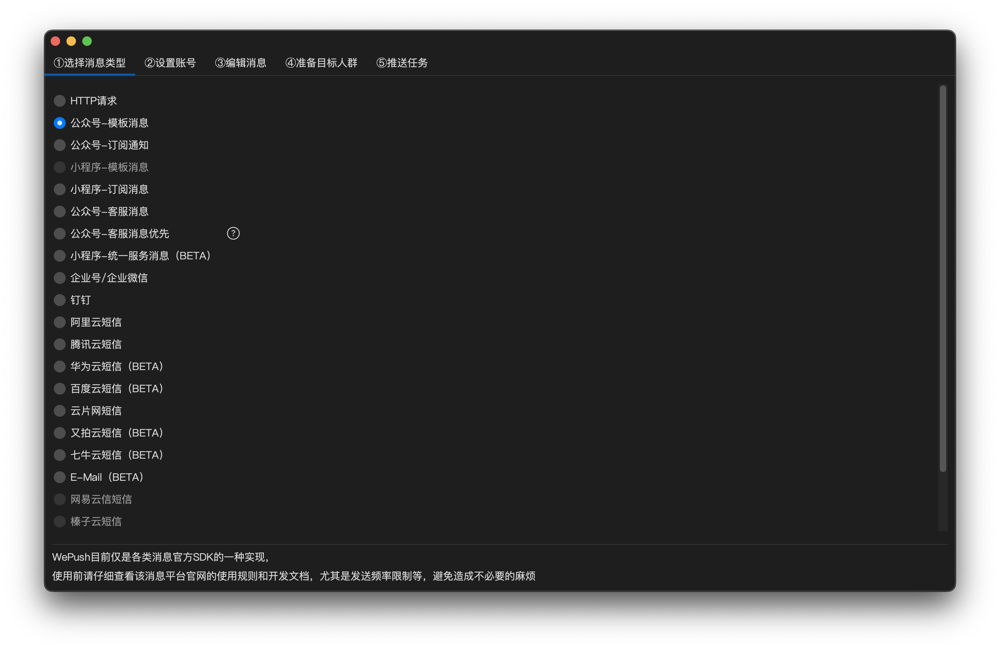
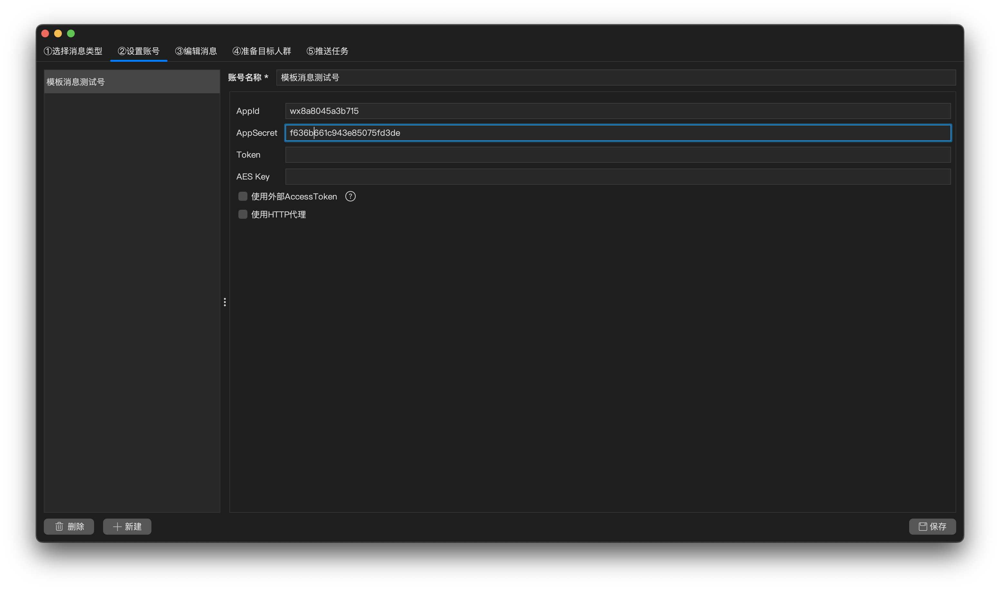
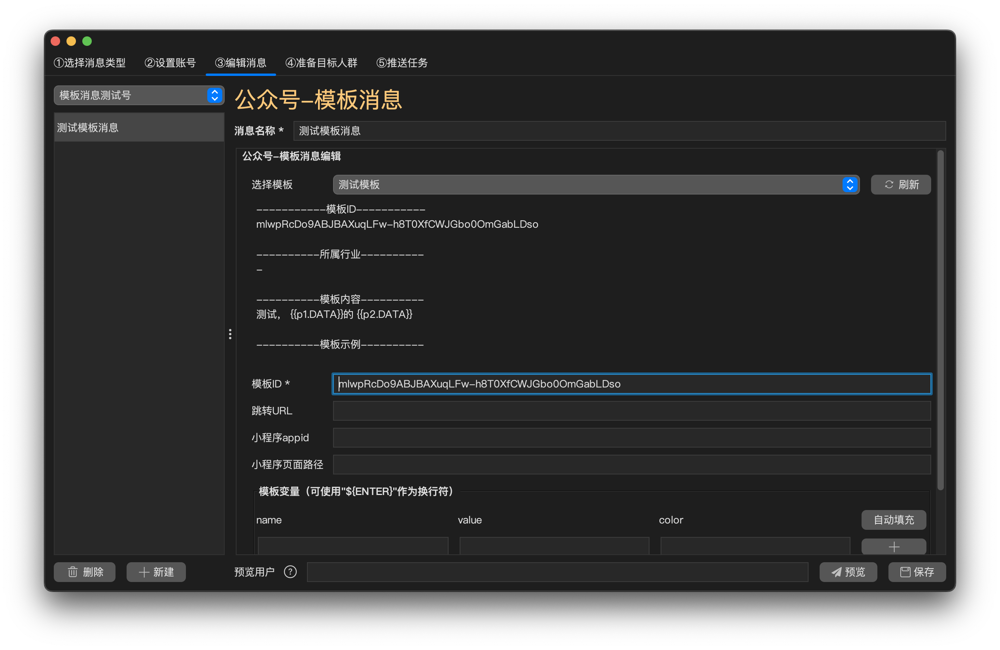
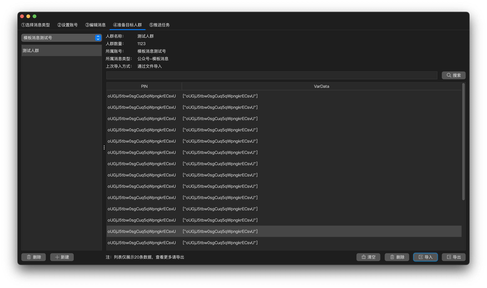
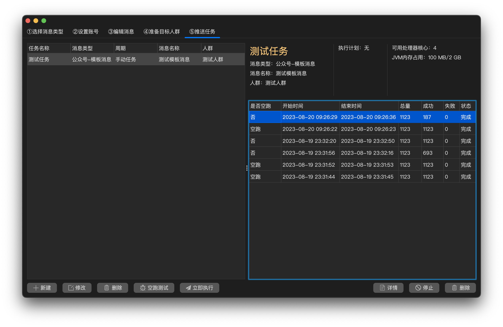
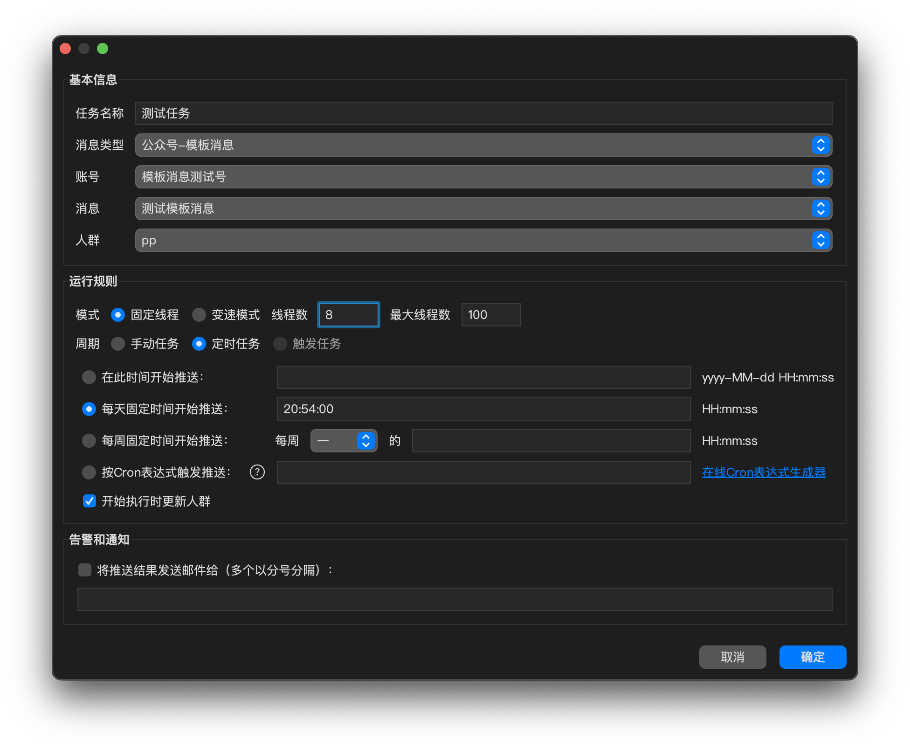
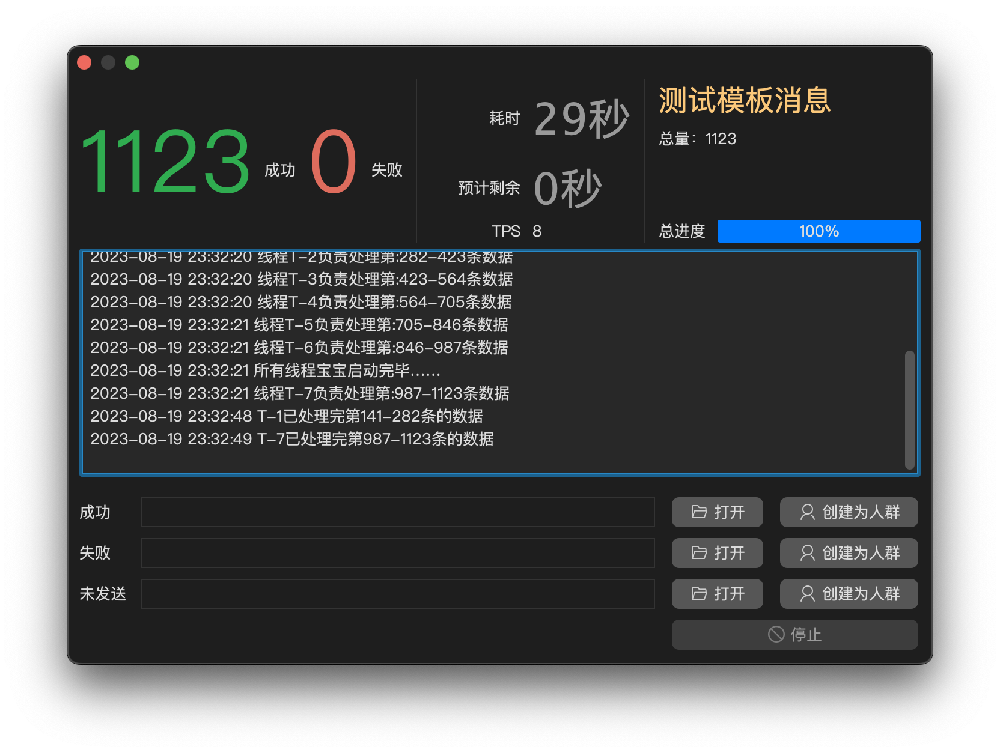
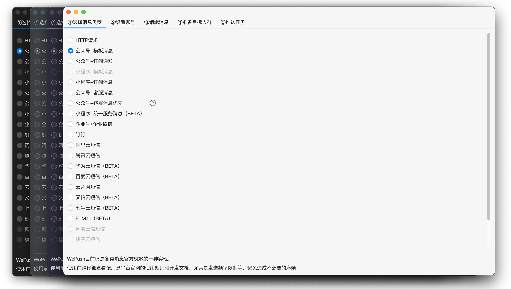

  
# WePush 
> 专注批量推送的小而美的工具  

## 产品线与版本选择

WePush 采用 Classic 与 Next 双轨发展。两条产品线彼此独立，允许按各自需要演进和拥有重复代码；Next 不会影响 Classic 的安装与使用。

| 产品线 | 当前定位 | 适合场景 | 入口 |
| --- | --- | --- | --- |
| WePush Classic | 稳定桌面客户端 | 微信、短信、邮件、HTTP 等成熟批量推送场景 | [Classic 下载](https://gitee.com/zhoubochina/WePush/releases) |
| WePush Next | `0.1.0-alpha.1` Public Preview + 后续源码开发 | Service/Agent、WebUI/Desktop、Service API、Remote/Embedded Java SDK 和新消息能力验证 | [Next 下载](https://github.com/rememberber/WePush/releases/tag/next-v0.1.0-alpha.1) |

### WePush Next Public Preview

Next 是位于 [`next/`](next/) 的完整新架构产品线，包含 Core Engine、Provider SPI、可安装 Service、远程 Agent、Remote/Embedded Java SDK、React WebUI 和 Electron Desktop。当前内置 HTTP Provider，支持可视化配置、运行中心、Cron 调度、动态调试 API 文档，以及 Standalone 和 Server/HA 两种部署基线。

#### Next 组件

| 组件 | 主要职责 | 形态与边界 |
| --- | --- | --- |
| [Core / Engine](next/core/) | 执行批量任务，管理并发、重试、暂停、恢复、取消、结果与运行事件 | 纯 Java 无界面执行内核，不直接提供网络 API，也不依赖 Service、UI 或具体 Provider |
| [Provider SPI / Provider](next/providers/) | 定义消息渠道扩展契约，负责账号校验、消息渲染和实际发送 | Core 只面向 SPI；当前内置 HTTP Provider，其他渠道可以作为独立插件发展 |
| [Service](next/service/) | 提供配置、调度、运行控制、Secret、Artifact、审计、REST/SSE、OpenAPI 和 Agent 控制面 | 可前台运行或安装为 Linux systemd、macOS launchd、Windows Service；本机模式可内嵌 Core Engine |
| [Agent](next/agent/) | 在独立主机接收 Lease，使用 Core Engine 执行任务并回传事件、结果和 Artifact | 可独立安装，通过 gRPC 主动连接 Service；本机内嵌执行时不需要 Agent |
| [Remote Java SDK](next/sdk/sdk-java/) | 让 Java 应用通过强类型客户端调用远程 Service API | 已实现；只依赖公开的 `service-api` 契约，不依赖 Core、Engine 或具体 Provider |
| [Embedded Java SDK](next/sdk/embedded-java/) | 让 Java 应用在自己的进程内直接装配 Core Engine 和选定 Provider，无需启动 Service | 当前源码已实现；允许依赖 Engine，Provider 必须由业务应用显式选择；已发布的 `alpha.1` 附件尚未包含 |
| [WebUI](next/ui/apps/web/) | 提供可视化配置、任务与调度、运行中心、Agent 观察和动态调试 API 文档 | TypeScript + Vite + React，可由 Service 直接托管，也可在开发环境独立运行 |
| [Desktop UI](next/ui/apps/desktop/) | 提供与 WebUI 一致的桌面管理体验和安全 Electron 外壳 | 连接本机 Service；当前不内嵌、不安装也不自动启动 Service |

当前典型调用关系为：`WebUI / Desktop UI / Remote Java SDK → Service API → Service → 内嵌 Core Engine`；远程执行时则由 `Service → Agent → Core Engine → Provider` 完成发送。进程内集成使用 `业务 Java 应用 → Embedded Java SDK → Core Engine → Provider`，不经过 Service。

第一次使用请从[《WePush Next 对外使用指南》](next/docs/user-guide.md)开始。当前预览版未使用商业代码签名，不建议直接用于关键生产业务。

- [Next 项目说明](next/README.md)
- [架构与概要设计](next/docs/architecture-and-high-level-design.md)
- [详细设计](next/docs/detailed-design.md)
- [部署与运维](next/docs/deployment-and-operations.md)
- [`0.1.0-alpha.1` Release Notes](next/docs/releases/0.1.0-alpha.1.md)

## WePush Classic

Classic 是现有稳定客户端，继续在仓库原有目录中独立维护和演进。

### 支持的平台
Windows • Linux • macOS

### 目前已经支持的消息类型
+ 模板消息-公众号  
+ 模板消息-小程序  
+ 订阅消息-小程序  
+ 微信客服消息（文本、图文、图片、小程序卡片）
+ 微信企业号/企业微信消息  
+ 企业微信小程序通知消息
+ 小程序统一服务消息  
+ 钉钉 
+ 飞书群自定义机器人（文本、富文本、消息卡片、原始 JSON；支持签名校验）
+ 阿里云短信  
+ 阿里大于模板短信  
+ 腾讯云短信  
+ 华为云短信  
+ 百度云短信 
+ 又拍云短信  
+ 七牛云短信  
+ 云片网短信  
+ 网易云信短信  
+ 榛子云短信  
+ Luosimao短信  
+ 极光短信  
+ 极光推送  
+ E-Mail
+ HTTP请求（单次、批量、压测）

### 功能&亮点
1. 支持自定义消息内容并批量推送  
2. 支持变量消息（可实现根据发送目标用户不同每条消息内容不一样）
3. 支持消息编辑、预览、消息管理  
4. 支持通过文件导入用户（txt、csv、excel）  
5. 支持通过MySQL导入用户  
6. 支持微信公众号全员推送  
7. 支持微信全家桶消息（公众号、小程序、企业号）
8. 支持各种粒度的定时推送  
9. 支持推送历史管理和失败重新推送  
10. 支持多账号管理和切换（微信） 
11. 支持各种搜索、导入、导出  
12. 小而美的可视化界面，支持亮暗多种外观风格  
13. 支持全局字体字号设置  
14. 支持推送结果邮件通知  
……

### 截图速览

### 安装文件下载

[WePush Classic 下载地址](https://gitee.com/zhoubochina/WePush/releases)

### 使用到的一些小技术点
+ Java  
+ Java Swing  
+ 线程池  
+ 连接池（数据库：HikariCP、HTTP：PoolingHttpClient）  
+ HttpClient  
+ HttpAsyncClient  
+ 定时任务  
+ SQLite  
+ MyBatis  

### 遇到的麻烦和挑战
+ Swing界面不好控制，导致需要投入较多精力和耐心
+ 工作过于饱和，经常到半夜很晚才挤出一点时间
+ 要做的事情有很多，比如WePush中间件及其附属的集消息中心、通知报警、任务、批量、重试、统计等于一身的方便部署的Web管理应用
+ 陪家人时间变少或无
+ 锻炼身体时间变少或无
+ 越来越发现需要不断学习源码和底层的重要性

### 特别感谢
[WxJava](https://gitee.com/binary/weixin-java-tools)  
[Hutool](http://hutool.cn/)  
[FlatLaf](https://www.formdev.com/flatlaf/)  

### 开发&构建

https://gitee.com/zhoubochina/WePush/wikis/build

### 使用帮助

https://gitee.com/zhoubochina/WePush/wikis/help  
QQ交流群：

  

### 鼓励&赞赏  
**如果WePush对您有所帮助或便利，  
欢迎对我每天下班和周末时光的努力进行肯定，  
您的赞赏将会给我带来更多动力**

  

